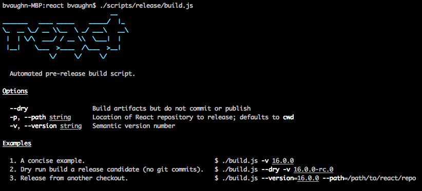
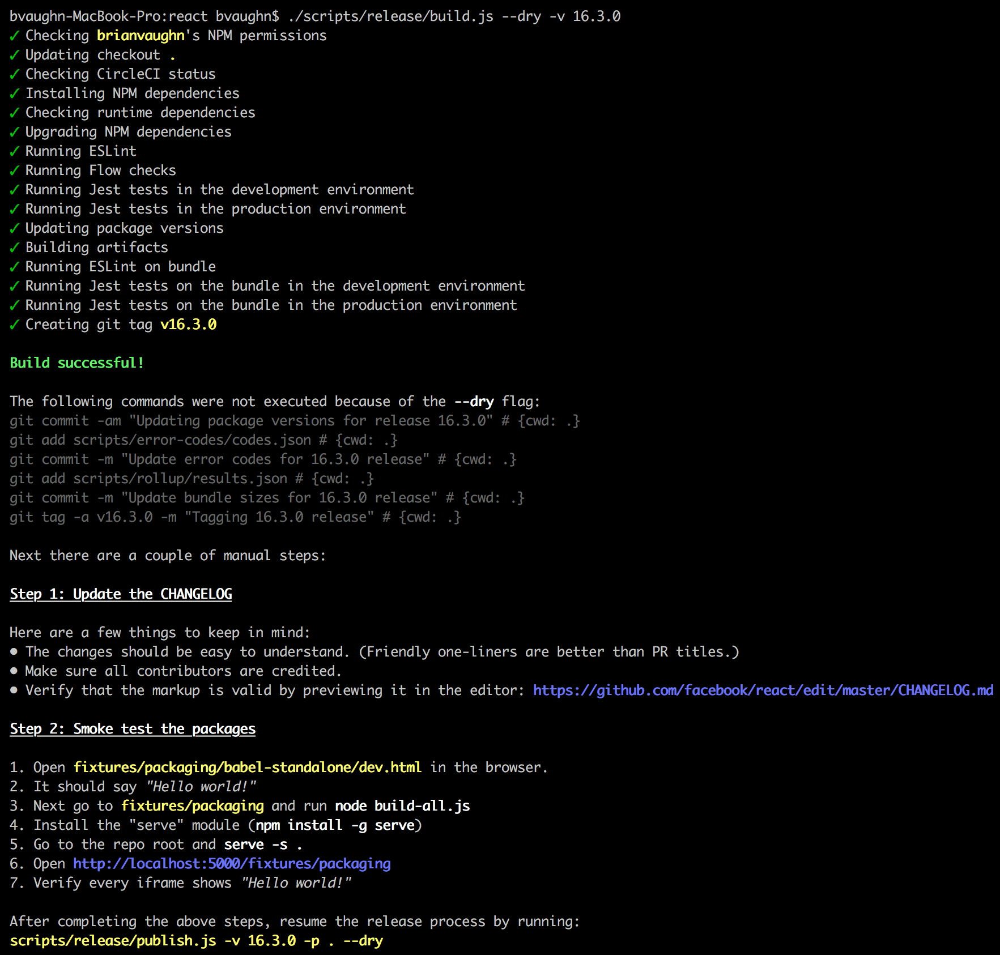
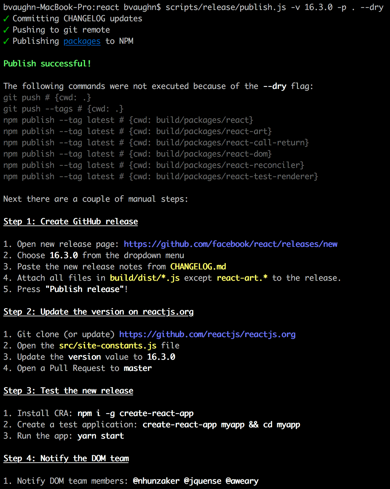

As we worked on [React 16](/blog/2017/09/26/react-v16.0.html), we revamped the folder structure and much of the build tooling in the React repository. Among other things, we introduced projects such as [Rollup](https://rollupjs.org/), [Prettier](https://prettier.io/), and [Google Closure Compiler](https://developers.google.com/closure/compiler/) into our workflow. People often ask us questions about how we use those tools. In this post, we would like to share some of the changes that we've made to our build and test infrastructure in 2017, and what motivated them.

While these changes helped us make React better, they don't affect most React users directly. However, we hope that blogging about them might help other library authors solve similar problems. Our contributors might also find these notes helpful!

## Formatting Code with Prettier {#formatting-code-with-prettier}

React was one of the first large repositories to [fully embrace](https://github.com/facebook/react/pull/9101) opinionated automatic code formatting with [Prettier](https://prettier.io/). Our current Prettier setup consists of:

* A local [`yarn prettier`](https://github.com/facebook/react/blob/cc52e06b490e0dc2482b345aa5d0d65fae931095/package.json#L115) script that [uses the Prettier Node API](https://github.com/facebook/react/blob/cc52e06b490e0dc2482b345aa5d0d65fae931095/scripts/prettier/index.js#L71-L77) to format files in place. We typically run it before committing changes. It is fast because it only checks the [files changed since diverging from remote master](https://github.com/facebook/react/blob/cc52e06b490e0dc2482b345aa5d0d65fae931095/scripts/shared/listChangedFiles.js#L29-L33).
* A script that [runs Prettier](https://github.com/facebook/react/blob/cc52e06b490e0dc2482b345aa5d0d65fae931095/scripts/prettier/index.js#L79-L90) as part of our [continuous integration checks](https://github.com/facebook/react/blob/d906de7f602df810c38aa622c83023228b047db6/scripts/circleci/test_entry_point.sh#L10). It won't attempt to overwrite the files, but instead will fail the build if any file differs from the Prettier output for that file. This ensures that we can't merge a pull request unless it has been fully formatted.

Some team members have also set up the [editor integrations](https://prettier.io/docs/en/editors.html). Our experience with Prettier has been fantastic, and we recommend it to any team that writes JavaScript.

## Restructuring the Monorepo {#restructuring-the-monorepo}

Ever since React was split into packages, it has been a [monorepo](https://danluu.com/monorepo/): a set of packages under the umbrella of a single repository. This made it easier to coordinate changes and share the tooling, but our folder structure was deeply nested and difficult to understand. It was not clear which files belonged to which package. After releasing React 16, we've decided to completely reorganize the repository structure. Here is how we did it.

### Migrating to Yarn Workspaces {#migrating-to-yarn-workspaces}

The Yarn package manager [introduced a feature called Workspaces](https://yarnpkg.com/blog/2017/08/02/introducing-workspaces/) a few months ago. This feature lets you tell Yarn where your monorepo's packages are located in the source tree. Every time you run `yarn`, in addition to installing your dependencies it also sets up the symlinks that point from your project's `node_modules` to the source folders of your packages.

Thanks to Workspaces, absolute imports between our own packages (such as importing `react` from `react-dom`) "just work" with any tools that support the Node resolution mechanism. The only problem we encountered was Jest not running the transforms inside the linked packages, but we [found a fix](https://github.com/facebook/jest/pull/4761), and it was merged into Jest.

To enable Yarn Workspaces, we added `"workspaces": ["packages/*"]` to our [`package.json`](https://github.com/facebook/react/blob/cc52e06b490e0dc2482b345aa5d0d65fae931095/package.json#L4-L6), and moved all the code into [top-level `packages/*` folders](https://github.com/facebook/react/tree/cc52e06b490e0dc2482b345aa5d0d65fae931095/packages), each with its own `package.json` file.

Each package is structured in a similar way. For every public API entry point such as `react-dom` or `react-dom/server`, there is a [file](https://github.com/facebook/react/blob/cc52e06b490e0dc2482b345aa5d0d65fae931095/packages/react-dom/index.js) in the package root folder that re-exports the implementation from the [`/src/`](https://github.com/facebook/react/tree/cc52e06b490e0dc2482b345aa5d0d65fae931095/packages/react-dom/src) subfolder. The decision to point entry points to the source rather than to the built versions was intentional. Typically, we re-run a subset of tests after every change during development. Having to build the project to run a test would have been prohibitively slow. When we publish packages to npm, we replace these entry points with files in the [`/npm/`](https://github.com/facebook/react/tree/cc52e06b490e0dc2482b345aa5d0d65fae931095/packages/react-dom/npm) folder that point to the build artifacts.

Not all packages have to be published on npm. For example, we keep some utilities that are tiny enough and can be safely duplicated in a [pseudo-package called `shared`](https://github.com/facebook/react/tree/cc52e06b490e0dc2482b345aa5d0d65fae931095/packages/shared). Our bundler is configured to [only treat `dependencies` declared from `package.json` as externals](https://github.com/facebook/react/blob/cc52e06b490e0dc2482b345aa5d0d65fae931095/scripts/rollup/build.js#L326-L329) so it happily bundles the `shared` code into `react` and `react-dom` without leaving any references to `shared/` in the build artifacts. So you can use Yarn Workspaces even if you don't plan to publish actual npm packages!

### Removing the Custom Module System {#removing-the-custom-module-system}

In the past, we used a non-standard module system called "Haste" that lets you import any file from any other file by its unique `@providesModule` directive no matter where it is in the tree. It neatly avoids the problem of deep relative imports with paths like `../../../../` and is great for the product code. However, this makes it hard to understand the dependencies between packages. We also had to resort to hacks to make it work with different tools.

We decided to [remove Haste](https://github.com/facebook/react/pull/11303) and use the Node resolution with relative imports instead. To avoid the problem of deep relative paths, we have [flattened our repository structure](https://github.com/facebook/react/pull/11304) so that it goes at most one level deep inside each package:

```
|-react
|  |-npm
|  |-src
|-react-dom
|  |-npm
|  |-src
|  |  |-client
|  |  |-events
|  |  |-server
|  |  |-shared
```

This way, the relative paths can only contain one `./` or `../` followed by the filename. If one package needs to import something from another package, it can do so with an absolute import from a top-level entry point.

In practice, we still have [some cross-package "internal" imports](https://github.com/facebook/react/blob/cc52e06b490e0dc2482b345aa5d0d65fae931095/packages/react-dom/src/client/ReactDOMFiberComponent.js#L10-L11) that violate this principle, but they're explicit, and we plan to gradually get rid of them.

## Compiling Flat Bundles {#compiling-flat-bundles}

Historically, React was distributed in two different formats: as a single-file build that you can add as a `<script>` tag in the browser, and as a collection of CommonJS modules that you can bundle with a tool like webpack or Browserify. 

Before React 16, each React source file had a corresponding CommonJS module that was published as part of the npm packages. Importing `react` or `react-dom` led bundlers to the package [entry point](https://unpkg.com/react@15/index.js) from which they would build a dependency tree with the CommonJS modules in the [internal `lib` folder](https://unpkg.com/react@15/lib/).

However, this approach had multiple disadvantages:

* **It was inconsistent.** Different tools produce bundles of different sizes for identical code importing React, with the difference going as far as 30 kB (before gzip).
* **It was inefficient for bundler users.** The code produced by most bundlers today contains a lot of "glue code" at the module boundaries. It keeps the modules isolated from each other, but increases the parse time, the bundle size, and the build time.
* **It was inefficient for Node users.** When running in Node, performing `process.env.NODE_ENV` checks before development-only code incurs the overhead of actually looking up environment variables. This slowed down React server rendering. We couldn't cache it in a variable either because it prevented dead code elimination with Uglify.
* **It broke encapsulation.** React internals were exposed both in the open source (as `react-dom/lib/*` imports) and internally at Facebook. It was convenient at first as a way to share utilities between projects, but with time it became a maintenance burden because renaming or changing argument types of internal functions would break unrelated projects.
* **It prevented experimentation.** There was no way for the React team to experiment with any advanced compilation techniques. For example, in theory, we might want to apply [Google Closure Compiler Advanced](https://developers.google.com/closure/compiler/docs/api-tutorial3) optimizations or [Prepack](https://prepack.io/) to some of our code, but they are designed to work on complete bundles rather than small individual modules that we used to ship to npm.

Due to these and other issues, we've changed the strategy in React 16. We still ship CommonJS modules for Node.js and bundlers, but instead of publishing many individual files in the npm package, we publish just two CommonJS bundles per entry point.

For example, when you import `react` with React 16, the bundler [finds the entry point](https://unpkg.com/react@16/index.js) that just re-exports one of the two files:

```js
'use strict';

if (process.env.NODE_ENV === 'production') {
  module.exports = require('./cjs/react.production.min.js');
} else {
  module.exports = require('./cjs/react.development.js');
}
```

In every package provided by React, the [`cjs` folder](https://unpkg.com/react@16/cjs/) (short for "CommonJS") contains a development and a production pre-built bundle for each entry point. 

For example, [`react.development.js`](https://unpkg.com/react@16/cjs/react.development.js) is the version intended for development. It is readable and includes comments. On the other hand, [`react.production.min.js`](https://unpkg.com/react@16/cjs/react.production.min.js) was minified and optimized before it was published to npm.

Note how this is essentially the same strategy that we've been using for the single-file browser builds (which now reside in the [`umd` directory](https://unpkg.com/react@16/umd/), short for [Universal Module Definition](https://www.davidbcalhoun.com/2014/what-is-amd-commonjs-and-umd/)). Now we just apply the same strategy to the CommonJS builds as well.

### Migrating to Rollup {#migrating-to-rollup}

Just compiling CommonJS modules into single-file bundles doesn't solve all of the above problems. The really significant wins came from [migrating our build system](https://github.com/facebook/react/pull/9327) from Browserify to [Rollup](https://rollupjs.org/).

[Rollup was designed with libraries rather than apps in mind](https://medium.com/webpack/webpack-and-rollup-the-same-but-different-a41ad427058c), and it is a perfect fit for React's use case. It solves one problem well: how to combine multiple modules into a flat file with minimal junk code in between. To achieve this, instead of turning modules into functions like many other bundlers, it puts all the code in the same scope, and renames variables so that they don't conflict. This produces code that is easier for the JavaScript engine to parse, for a human to read, and for a minifier to optimize.

Rollup currently doesn't support some features that are important to application builders, such as code splitting. However, it does not aim to replace tools like webpack that do a great job at this. Rollup is a perfect fit for *libraries* like React that can be pre-built and then integrated into apps.

You can find our Rollup build configuration [here](https://github.com/facebook/react/blob/8ec146c38ee4f4c84b6ecf59f52de3371224e8bd/scripts/rollup/build.js#L336-L362), with a [list of plugins we currently use](https://github.com/facebook/react/blob/8ec146c38ee4f4c84b6ecf59f52de3371224e8bd/scripts/rollup/build.js#L196-L273).

### Migrating to Google Closure Compiler {#migrating-to-google-closure-compiler}

After migrating to flat bundles, we [started](https://github.com/facebook/react/pull/10236) using [the JavaScript version of the Google Closure Compiler](https://github.com/google/closure-compiler-js) in its "simple" mode. In our experience, even with the advanced optimizations disabled, it still provided a significant advantage over Uglify, as it was able to better eliminate dead code and automatically inline small functions when appropriate.

At first, we could only use Google Closure Compiler for the React bundles we shipped in the open source. At Facebook, we still needed the checked-in bundles to be unminified so we could symbolicate React production crashes with our error reporting tools. We ended up contributing [a flag](https://github.com/google/closure-compiler/pull/2707) that completely disables the renaming compiler pass. This lets us apply other optimizations like function inlining, but keep the code fully readable for the Facebook-specific builds of React. To improve the output readability, we [also format that custom build using Prettier](https://github.com/facebook/react/blob/cc52e06b490e0dc2482b345aa5d0d65fae931095/scripts/rollup/build.js#L249-L250). Interestingly, running Prettier on production bundles while debugging the build process is a great way to find unnecessary code in the bundles!

Currently, all production React bundles [run through Google Closure Compiler in simple mode](https://github.com/facebook/react/blob/cc52e06b490e0dc2482b345aa5d0d65fae931095/scripts/rollup/build.js#L235-L248), and we may look into enabling advanced optimizations in the future.

### Protecting Against Weak Dead Code Elimination {#protecting-against-weak-dead-code-elimination}

While we use an efficient [dead code elimination](https://en.wikipedia.org/wiki/Dead_code_elimination) solution in React itself, we can't make a lot of assumptions about the tools used by the React consumers.

Typically, when you [configure a bundler for production](/docs/optimizing-performance.html#use-the-production-build), you need to tell it to substitute `process.env.NODE_ENV` with the `"production"` string literal. This process is sometimes called "envification". Consider this code:

```js
if (process.env.NODE_ENV !== "production") {
  // development-only code
}
```

After envification, this condition will always be `false`, and can be completely eliminated by most minifiers:

```js
if ("production" !== "production") {
  // development-only code
}
```

However, if the bundler is misconfigured, you can accidentally ship development code into production. We can't completely prevent this, but we took a few steps to mitigate the common cases when it happens.

#### Protecting Against Late Envification {#protecting-against-late-envification}

As mentioned above, our entry points now look like this:

```js
'use strict';

if (process.env.NODE_ENV === 'production') {
  module.exports = require('./cjs/react.production.min.js');
} else {
  module.exports = require('./cjs/react.development.js');
}
```

However, some bundlers process `require`s before envification. In this case, even if the `else` block never executes, the `cjs/react.development.js` file still gets bundled.

To prevent this, we also [wrap the whole content](https://github.com/facebook/react/blob/d906de7f602df810c38aa622c83023228b047db6/scripts/rollup/wrappers.js#L65-L69) of the development bundle into another `process.env.NODE_ENV` check inside the `cjs/react.development.js` bundle itself:

```js
'use strict';

if (process.env.NODE_ENV !== "production") {
  (function() {
    // bundle code
  })();
}
```

This way, even if the application bundle includes both the development and the production versions of the file, the development version will be empty after envification.

The additional [IIFE](https://en.wikipedia.org/wiki/Immediately-invoked_function_expression) wrapper is necessary because some declarations (e.g. functions) can't be placed inside an `if` statement in JavaScript.

#### Detecting Misconfigured Dead Code Elimination {#detecting-misconfigured-dead-code-elimination}

Even though [the situation is changing](https://twitter.com/iamakulov/status/941336777188696066), many popular bundlers don't yet force the users to specify the development or production mode. In this case `process.env.NODE_ENV` is typically provided by a runtime polyfill, but the dead code elimination doesn't work.

We can't completely prevent React users from misconfiguring their bundlers, but we introduced a few additional checks for this in [React DevTools](https://github.com/facebook/react-devtools).

If the development bundle executes, [React DOM reports this to React DevTools](https://github.com/facebook/react/blob/d906de7f602df810c38aa622c83023228b047db6/packages/react-dom/src/client/ReactDOM.js#L1333-L1335):

<br>


There is also one more bad scenario. Sometimes, `process.env.NODE_ENV` is set to `"production"` at runtime rather than at the build time. This is how it should work in Node.js, but it is bad for the client-side builds because the unnecessary development code is bundled even though it never executes. This is harder to detect but we found a heuristic that works well in most cases and doesn't seem to produce false positives.

We can write a function that contains a [development-only branch](https://github.com/facebook/react/blob/d906de7f602df810c38aa622c83023228b047db6/packages/react-dom/npm/index.js#L11-L20) with an arbitrary string literal. Then, if `process.env.NODE_ENV` is set to `"production"`, we can [call `toString()` on that function](https://github.com/facebook/react-devtools/blob/b370497ba6e873c63479408f11d784095523a630/backend/installGlobalHook.js#L143) and verify that the string literal in the development-only has been stripped out. If it is still there, the dead code elimination didn't work, and we need to warn the developer. Since developers might not notice the React DevTools warnings on a production website, we also [throw an error inside `setTimeout`](https://github.com/facebook/react-devtools/blob/b370497ba6e873c63479408f11d784095523a630/backend/installGlobalHook.js#L153-L160) from React DevTools in the hope that it will be picked up by the error analytics.

We recognize this approach is somewhat fragile. The `toString()` method is not reliable and may change its behavior in future browser versions. This is why we put that logic into React DevTools itself rather than into React. This allows us to remove it later if it becomes problematic. We also warn only if we *found* the special string literal rather than if we *didn't* find it. This way, if the `toString()` output becomes opaque, or is overridden, the warning just won't fire.

## Catching Mistakes Early {#catching-mistakes-early}

We want to catch bugs as early as possible. However, even with our extensive test coverage, occasionally we make a blunder. We made several changes to our build and test infrastructure this year to make it harder to mess up.

### Migrating to ES Modules {#migrating-to-es-modules}

With the CommonJS `require()` and `module.exports`, it is easy to import a function that doesn't really exist, and not realize that until you call it. However, tools like Rollup that natively support [`import`](https://developer.mozilla.org/en-US/docs/Web/JavaScript/Reference/Statements/import) and [`export`](https://developer.mozilla.org/en-US/docs/web/javascript/reference/statements/export) syntax fail the build if you mistype a named import. After releasing React 16, [we have converted the entire React source code](https://github.com/facebook/react/pull/11389) to the ES Modules syntax.

Not only did this provide some extra protection, but it also helped improve the build size. Many React modules only export utility functions, but CommonJS forced us to wrap them into an object. By turning those utility functions into named exports and eliminating the objects that contained them, we let Rollup place them into the top-level scope, and thus let the minifier mangle their names in the production builds.

For now, have decided to only convert the source code to ES Modules, but not the tests. We use powerful utilities like `jest.resetModules()` and want to retain tighter control over when the modules get initialized in tests. In order to consume ES Modules from our tests, we enabled the [Babel CommonJS transform](https://github.com/facebook/react/blob/cc52e06b490e0dc2482b345aa5d0d65fae931095/scripts/jest/preprocessor.js#L28-L29), but only for the test environment.

### Running Tests in Production Mode {#running-tests-in-production-mode}

Historically, we've been running all tests in a development environment. This let us assert on the warning messages produced by React, and seemed to make general sense. However, even though we try to keep the differences between the development and production code paths minimal, occasionally we would make a mistake in production-only code branches that weren't covered by tests, and cause an issue at Facebook.

To solve this problem, we have added a new [`yarn test-prod`](https://github.com/facebook/react/blob/cc52e06b490e0dc2482b345aa5d0d65fae931095/package.json#L110) command that runs on CI for every pull request, and [executes all React test cases in the production mode](https://github.com/facebook/react/pull/11616). We wrapped any assertions about warning messages into development-only conditional blocks in all tests so that they can still check the rest of the expected behavior in both environments. Since we have a custom Babel transform that replaces production error messages with the [error codes](/blog/2016/07/11/introducing-reacts-error-code-system.html), we also added a [reverse transformation](https://github.com/facebook/react/blob/cc52e06b490e0dc2482b345aa5d0d65fae931095/scripts/jest/setupTests.js#L91-L126) as part of the production test run.

### Using Public API in Tests {#using-public-api-in-tests}

When we were [rewriting the React reconciler](https://code.facebook.com/posts/1716776591680069/react-16-a-look-inside-an-api-compatible-rewrite-of-our-frontend-ui-library/), we recognized the importance of writing tests against the public API instead of internal modules. If the test is written against the public API, it is clear what is being tested from the user's perspective, and you can run it even if you rewrite the implementation from scratch.

We reached out to the wonderful React community [asking for help](https://github.com/facebook/react/issues/11299) converting the remaining tests to use the public API. Almost all of the tests are converted now! The process wasn't easy. Sometimes a unit test just calls an internal method, and it's hard to figure out what the observable behavior from user's point of view was supposed to be tested. We found a few strategies that helped with this. The first thing we would try is to find the git history for when the test was added, and find clues in the issue and pull request description. Often they would contain reproducing cases that ended up being more valuable than the original unit tests! A good way to verify the guess is to try commenting out individual lines in the source code being tested. If the test fails, we know for sure that it stresses the given code path.

We would like to give our deepest thanks to [everyone who contributed to this effort](https://github.com/facebook/react/issues?q=is%3Apr+11299+is%3Aclosed).

### Running Tests on Compiled Bundles {#running-tests-on-compiled-bundles}

There is also one more benefit to writing tests against the public API: now we can [run them against the compiled bundles](https://github.com/facebook/react/pull/11633).

This helps us ensure that tools like Babel, Rollup, and Google Closure Compiler don't introduce any regressions. This also opens the door for future more aggressive optimizations, as we can be confident that React still behaves exactly as expected after them.

To implement this, we have created a [second Jest config](https://github.com/facebook/react/blob/cc52e06b490e0dc2482b345aa5d0d65fae931095/scripts/jest/config.build.js). It overrides our default config but points `react`, `react-dom`, and other entry points to the `/build/packages/` folder. This folder doesn't contain any React source code, and reflects what gets published to npm. It is populated after you run `yarn build`.

This lets us run the same exact tests that we normally run against the source, but execute them using both development and production pre-built React bundles produced with Rollup and Google Closure Compiler.

Unlike the normal test run, the bundle test run depends on the build products so it is not great for quick iteration. However, it still runs on the CI server so if something breaks, the test will display as failed, and we will know it's not safe to merge into master.

There are still some test files that we intentionally don't run against the bundles. Sometimes we want to mock an internal module or override a feature flag that isn't exposed to the public yet. For those cases, we blacklist a test file by renaming it from `MyModule-test.js` to `MyModule-test.internal.js`.

Currently, over 93% out of 2,650 React tests run against the compiled bundles.

### Linting Compiled Bundles {#linting-compiled-bundles}

In addition to linting our source code, we run a much more limited set of lint rules (really, [just two of them](https://github.com/facebook/react/blob/cc52e06b490e0dc2482b345aa5d0d65fae931095/scripts/rollup/validate/eslintrc.cjs.js#L26-L27)) on the compiled bundles. This gives us an extra layer of protection against regressions in the underlying tools and [ensures](https://github.com/facebook/react/blob/cc52e06b490e0dc2482b345aa5d0d65fae931095/scripts/rollup/validate/eslintrc.cjs.js#L22) that the bundles don't use any language features that aren't supported by older browsers.

### Simulating Package Publishing {#simulating-package-publishing}

Even running the tests on the built packages is not enough to avoid shipping a broken update. For example, we use the `files` field in our `package.json` files to specify a whitelist of folders and files that should be published on npm. However, it is easy to add a new entry point to a package but forget to add it to the whitelist. Even the bundle tests would pass, but after publishing the new entry point would be missing.

To avoid situations like this, we are now simulating the npm publish by [running `npm pack` and then immediately unpacking the archive](https://github.com/facebook/react/blob/cc52e06b490e0dc2482b345aa5d0d65fae931095/scripts/rollup/packaging.js#L129-L134) after the build. Just like `npm publish`, this command filters out anything that isn't in the `files` whitelist. With this approach, if we were to forget adding an entry point to the list, it would be missing in the build folder, and the bundle tests relying on it would fail.

### Creating Manual Test Fixtures {#creating-manual-test-fixtures}

Our unit tests run only in the Node environment, but not in the browsers. This was an intentional decision because browser-based testing tools were flaky in our experience, and didn't catch many issues anyway.

We could get away with this because the code that touches the DOM is consolidated in a few files, and doesn't change that often. Every week, we update the Facebook.com codebase to the latest React commit on master. At Facebook, we use a set of internal [WebDriver](http://www.seleniumhq.org/projects/webdriver/) tests for critical product workflows, and these catch some regressions. React updates are first delivered to employees, so severe bugs get reported immediately before they reach two billion users.

Still, it was hard to review DOM-related changes, and occasionally we would make mistakes. In particular, it was hard to remember all the edge cases that the code had to handle, why they were added, and when it was safe to remove them. We considered adding some automatic tests that run in the browser but we didn't want to slow down the development cycle and deal with a fragile CI. Additionally, automatic tests don't always catch DOM issues. For example, an input value displayed by the browser may not match what it reports as a DOM property.

We've chatted about this with [Brandon Dail](https://github.com/aweary), [Jason Quense](https://github.com/jquense), and [Nathan Hunzaker](https://github.com/nhunzaker). They were sending substantial patches to React DOM but were frustrated that we failed to review them timely. We decided to give them commit access, but asked them to [create a set of manual tests](https://github.com/facebook/react/pull/8589) for DOM-related areas like input management. The initial set of manual fixtures [kept growing](https://github.com/facebook/react/commits/master/fixtures/dom) over the year.

These fixtures are implemented as a React app located in [`fixtures/dom`](https://github.com/facebook/react/tree/d906de7f602df810c38aa622c83023228b047db6/fixtures/dom). Adding a fixture involves writing a React component with a description of the expected behavior, and links to the appropriate issues and browser quirks, like [in this example](https://github.com/facebook/react/pull/11760):


The fixture app lets you choose a version of React (local or one of the published versions) which is handy for comparing the behavior before and after the changes. When we change the behavior related to how we interact with the DOM, we can verify that it didn't regress by going through the related fixtures in different browsers.

In some cases, a change proved to be so complex that it necessitated a standalone purpose-built fixture to verify it. For example, the [DOM attribute handling in React 16](/blog/2017/09/08/dom-attributes-in-react-16.html) was very hard to pull off with confidence at first. We kept discovering different edge cases, and almost gave up on doing it in time for the React 16 release. However, then we've built an ["attribute table" fixture](https://github.com/facebook/react/tree/d906de7f602df810c38aa622c83023228b047db6/fixtures/attribute-behavior) that renders all supported attributes and their misspellings with previous and next version of React, and displays the differences. It took a few iterations (the key insight was to group attributes with similar behavior together) but it ultimately allowed us to fix all major issues in just a few days.

<br>

<blockquote class="twitter-tweet"><p lang="en" dir="ltr">We went through the table to vet the new behavior for every case (and discovered some old bugs too) <a href="https://t.co/cmF2qnK9Q9">pic.twitter.com/cmF2qnK9Q9</a></p>&mdash; Dan Abramov (@dan_abramov) <a href="https://twitter.com/dan_abramov/status/906244378066345984?ref_src=twsrc%5Etfw">September 8, 2017</a></blockquote> <script async src="https://platform.twitter.com/widgets.js" charset="utf-8"></script>

Going through the fixtures is still a lot of work, and we are considering automating some of it. Still, the fixture app is invaluable even as documentation for the existing behavior and all the edge cases and browser bugs that React currently handles. Having it gives us confidence in making significant changes to the logic without breaking important use cases. Another improvement we're considering is to have a GitHub bot build and deploy the fixtures automatically for every pull request that touches the relevant files so anyone can help with browser testing.

### Preventing Infinite Loops {#preventing-infinite-loops}

The React 16 codebase contains many `while` loops. They let us avoid the dreaded deep stack traces that occurred with earlier versions of React, but can make development of React really difficult. Every time there is a mistake in an exit condition our tests would just hang, and it took a while to figure out which of the loops is causing the issue.

Inspired by the [strategy adopted by Repl.it](https://repl.it/site/blog/infinite-loops), we have added a [Babel plugin that prevents infinite loops](https://github.com/facebook/react/blob/d906de7f602df810c38aa622c83023228b047db6/scripts/babel/transform-prevent-infinite-loops.js) in the test environment. If some loop continues for more than the maximum allowed number of iterations, we throw an error and immediately fail it so that Jest can display where exactly this happened.

This approach has a pitfall. If an error thrown from the Babel plugin gets caught and ignored up the call stack, the test will pass even though it has an infinite loop. This is really, really bad. To solve this problem, we [set a global field](https://github.com/facebook/react/blob/d906de7f602df810c38aa622c83023228b047db6/scripts/babel/transform-prevent-infinite-loops.js#L26-L30) before throwing the error. Then, after every test run, we [rethrow that error if the global field has been set](https://github.com/facebook/react/blob/d906de7f602df810c38aa622c83023228b047db6/scripts/jest/setupTests.js#L42-L56). This way any infinite loop will cause a test failure, no matter whether the error from the Babel plugin was caught or not.

## Customizing the Build {#customizing-the-build}

There were a few things that we had to fine-tune after introducing our new build process. It took us a while to figure them out, but we're moderately happy with the solutions that we arrived at.

### Dead Code Elimination {#dead-code-elimination}

The combination of Rollup and Google Closure Compiler already gets us pretty far in terms of stripping development-only code in production bundles. We [replace](https://github.com/facebook/react/blob/cc52e06b490e0dc2482b345aa5d0d65fae931095/scripts/rollup/build.js#L223-L226) the `__DEV__` literal with a boolean constant during the build, and both Rollup together and Google Closure Compiler can strip out the `if (false) {}` code branches and even some more sophisticated patterns. However, there is one particularly nasty case:

```js
import warning from 'fbjs/lib/warning';

if (__DEV__) {
  warning(false, 'Blimey!');
}
```

This pattern is very common in the React source code. However `fbjs/lib/warning` is an external import that isn't being bundled by Rollup for the CommonJS bundle. Therefore, even if `warning()` call ends up being removed, Rollup doesn't know whether it's safe to remove to the import itself. What if the module performs a side effect during initialization? Then removing it would not be safe.

To solve this problem, we use the [`treeshake.pureExternalModules` Rollup option](https://github.com/facebook/react/blob/cc52e06b490e0dc2482b345aa5d0d65fae931095/scripts/rollup/build.js#L338-L340) which takes an array of modules that we can guarantee don't have side effects. This lets Rollup know that an import to `fbjs/lib/warning` is safe to completely strip out if its value is not being used. However, if it *is* being used (e.g. if we decide to add warnings in production), the import will be preserved. That's why this approach is safer than replacing modules with empty shims.

When we optimize something, we need to ensure it doesn't regress in the future. What if somebody introduces a new development-only import of an external module, and not realize they also need to add it to `pureExternalModules`? Rollup prints a warning in such cases but we've [decided to fail the build completely](https://github.com/facebook/react/blob/cc52e06b490e0dc2482b345aa5d0d65fae931095/scripts/rollup/build.js#L395-L412) instead. This forces the person adding a new external development-only import to [explicitly specify whether it has side effects or not](https://github.com/facebook/react/blob/cc52e06b490e0dc2482b345aa5d0d65fae931095/scripts/rollup/modules.js#L10-L22) every time.

### Forking Modules {#forking-modules}

In some cases, different bundles need to contain slightly different code. For example, React Native bundles have a different error handling mechanism that shows a redbox instead of printing a message to the console. However, it can be very inconvenient to thread these differences all the way through the calling modules.

Problems like this are often solved with runtime configuration. However, sometimes it is impossible: for example, the React DOM bundles shouldn't even attempt to import the React Native redbox helpers. It is also unfortunate to bundle the code that never gets used in a particular environment.

Another solution is to use dynamic dependency injection. However, it often produces code that is hard to understand, and may cause cyclical dependencies. It also defies some optimization opportunities.

From the code point of view, ideally we just want to "redirect" a module to its different "forks" for specific bundles. The "forks" have the exact same API as the original modules, but do something different. We found this mental model very intuitive, and [created a fork configuration file](https://github.com/facebook/react/blob/cc52e06b490e0dc2482b345aa5d0d65fae931095/scripts/rollup/forks.js) that specifies how the original modules map to their forks, and the conditions under which this should happen.

For example, this fork config entry specifies different [feature flags](https://github.com/facebook/react/blob/cc52e06b490e0dc2482b345aa5d0d65fae931095/packages/shared/ReactFeatureFlags.js) for different bundles:

```js
'shared/ReactFeatureFlags': (bundleType, entry) => {
  switch (entry) {
    case 'react-native-renderer':
      return 'shared/forks/ReactFeatureFlags.native.js';
    case 'react-cs-renderer':
      return 'shared/forks/ReactFeatureFlags.native-cs.js';
    default:
      switch (bundleType) {
        case FB_DEV:
        case FB_PROD:
          return 'shared/forks/ReactFeatureFlags.www.js';
      }
  }
  return null;
},
```

During the build, [our custom Rollup plugin](https://github.com/facebook/react/blob/cc52e06b490e0dc2482b345aa5d0d65fae931095/scripts/rollup/plugins/use-forks-plugin.js#L40) replaces modules with their forks if the conditions have matched. Since both the original modules and the forks are written as ES Modules, Rollup and Google Closure Compiler can inline constants like numbers or booleans, and thus efficiently eliminate dead code for disabled feature flags. In tests, when necessary, we [use `jest.mock()`](https://github.com/facebook/react/blob/cc52e06b490e0dc2482b345aa5d0d65fae931095/packages/react-cs-renderer/src/__tests__/ReactNativeCS-test.internal.js#L15-L17) to point the module to the appropriate forked version.

As a bonus, we might want to verify that the export types of the original modules match the export types of the forks exactly. We can use a [slightly odd but totally working Flow trick](https://github.com/facebook/react/blob/cc52e06b490e0dc2482b345aa5d0d65fae931095/packages/shared/forks/ReactFeatureFlags.native.js#L32-L36) to accomplish this:

```js
import typeof * as FeatureFlagsType from 'shared/ReactFeatureFlags';
import typeof * as FeatureFlagsShimType from './ReactFeatureFlags.native';
type Check<_X, Y: _X, X: Y = _X> = null;
(null: Check<FeatureFlagsShimType, FeatureFlagsType>);
```

This works by essentially forcing Flow to verify that two types are assignable to each other (and thus are equivalent). Now if we modify the exports of either the original module or the fork without changing the other file, the type check will fail. This might be a little goofy but we found this helpful in practice.

To conclude this section, it is important to note that you can't specify your own module forks if you consume React from npm. This is intentional because none of these files are public API, and they are not covered by the [semver](https://semver.org/) guarantees. However, you are always welcome to build React from master or even fork it if you don't mind the instability and the risk of divergence. We hope that this writeup was still helpful in documenting one possible approach to targeting different environments from a single JavaScript library.

### Tracking Bundle Size {#tracking-bundle-size}

As a final build step, we now [record build sizes for all bundles](https://github.com/facebook/react/blob/d906de7f602df810c38aa622c83023228b047db6/scripts/rollup/build.js#L264-L272) and write them to a file that [looks like this](https://github.com/facebook/react/blob/d906de7f602df810c38aa622c83023228b047db6/scripts/rollup/results.json). When you run `yarn build`, it prints a table with the results:

<br>


*(It doesn't always look as good as this. This was the commit that migrated React from Uglify to Google Closure Compiler.)*

Keeping the file sizes committed for everyone to see was helpful for tracking size changes and motivating people to find optimization opportunities.

We haven't been entirely happy with this strategy because the JSON file often causes merge conflicts on larger branches. Updating it is also not currently enforced so it gets out of date. In the future, we're considering integrating a bot that would comment on pull requests with the size changes.

## Simplifying the Release Process {#simplifying-the-release-process}

We like to release updates to the open source community often. Unfortunately, the old process of creating a release was slow and would typically take an entire day. After some changes to this process, we're now able to do a full release in less than an hour. Here's what we changed.

### Branching Strategy {#branching-strategy}

Most of the time spent in the old release process was due to our branching strategy. The `master` branch was assumed to be unstable and would often contain breaking changes. Releases were done from a `stable` branch, and changes were manually cherry-picked into this branch prior to a release. We had [tooling to help automate](https://github.com/facebook/react/pull/7330) some of this process, but it was still [pretty complicated to use](https://github.com/facebook/react/blob/b5a2a1349d6e804d534f673612357c0be7e1d701/scripts/release-manager/Readme.md).

As of version 16, we now release from the `master` branch. Experimental features and breaking changes are allowed, but must be hidden behind [feature flags](https://github.com/facebook/react/blob/cc52e06b490e0dc2482b345aa5d0d65fae931095/packages/shared/ReactFeatureFlags.js) so they can be removed during the build process. The new flat bundles and dead code elimination make it possible for us to do this without fear of leaking unwanted code into open source builds.

### Automated Scripts {#automated-scripts}

After changing to a stable `master`, we created a new [release process checklist](https://github.com/facebook/react/issues/10620). Although much simpler than the previous process, this still involved dozens of steps and forgetting one could result in a broken release.

To address this, we created a new [automated release process](https://github.com/facebook/react/pull/11223) that is [much easier to use](https://github.com/facebook/react/tree/main/scripts/release#react-release-script) and has several built-in checks to ensure that we release a working build. The new process is split into two steps: _build_ and _publish_. Here's what it looks like the first time you run it:



The _build_ step does most of the work- verifying permissions, running tests, and checking CI status. Once it finishes, it prints a reminder to update the CHANGELOG and to verify the bundle using the [manual fixtures](#creating-manual-test-fixtures) described above.



All that's left is to tag and publish the release to NPM using the _publish_ script.



(You may have noticed a `--dry` flag in the screenshots above. This flag allows us to run a release, end-to-end, without actually publishing to NPM. This is useful when working on the release script itself.)

## In Conclusion {#in-conclusion}

Did this post inspire you to try some of these ideas in your own projects? We certainly hope so! If you have other ideas about how React build, test, or contribution workflow could be improved, please let us know on [our issue tracker](https://github.com/facebook/react/issues).

You can find the related issues by the [build infrastructure label](https://github.com/facebook/react/labels/Component%3A%20Build%20Infrastructure). These are often great first contribution opportunities!

## Acknowledgements {#acknowledgements}

We would like to thank:

* [Rich Harris](https://github.com/Rich-Harris) and [Lukas Taegert](https://github.com/lukastaegert) for maintaining Rollup and helping us integrate it.
* [Dimitris Vardoulakis](https://github.com/dimvar), [Chad Killingsworth](https://github.com/ChadKillingsworth), and [Tyler Breisacher](https://github.com/MatrixFrog) for their work on Google Closure Compiler and timely advice.
* [Adrian Carolli](https://github.com/watadarkstar), [Adams Au](https://github.com/rivenhk), [Alex Cordeiro](https://github.com/accordeiro), [Jordan Tepper](https://github.com/HeroProtagonist), [Johnson Shi](https://github.com/sjy), [Soo Jae Hwang](https://github.com/misoguy), [Joe Lim](https://github.com/xjlim), [Yu Tian](https://github.com/yu-tian113), and others for helping prototype and implement some of these and other improvements.
* [Anushree Subramani](https://github.com/anushreesubramani), [Abid Uzair](https://github.com/abiduzz420), [Sotiris Kiritsis](https://github.com/skiritsis), [Tim Jacobi](https://github.com/timjacobi), [Anton Arboleda](https://github.com/aarboleda1), [Jeremias Menichelli](https://github.com/jeremenichelli), [Audy Tanudjaja](https://github.com/audyodi), [Gordon Dent](https://github.com/gordyd), [Iacami Gevaerd
](https://github.com/enapupe), [Lucas Lentz](https://github.com/sadpandabear), [Jonathan Silvestri](https://github.com/silvestrijonathan), [Mike Wilcox](https://github.com/mjw56), [Bernardo Smaniotto](https://github.com/smaniotto), [Douglas Gimli](https://github.com/douglasgimli), [Ethan Arrowood](https://github.com/ethan-arrowood), and others for their help porting the React test suite to use the public API.
