React 16.5 adds support for a new DevTools profiler plugin.
This plugin uses React's [experimental Profiler API](https://github.com/reactjs/rfcs/pull/51) to collect timing information about each component that's rendered in order to identify performance bottlenecks in React applications.
It will be fully compatible with our upcoming [time slicing and suspense](/blog/2018/03/01/sneak-peek-beyond-react-16.html) features.

This blog post covers the following topics:
* [Profiling an application](#profiling-an-application)
* [Reading performance data](#reading-performance-data)
  * [Browsing commits](#browsing-commits)
  * [Filtering commits](#filtering-commits)
  * [Flame chart](#flame-chart)
  * [Ranked chart](#ranked-chart)
  * [Component chart](#component-chart)
  * [Interactions](#interactions)
* [Troubleshooting](#troubleshooting)
  * [No profiling data has been recorded for the selected root](#no-profiling-data-has-been-recorded-for-the-selected-root)
  * [No timing data to display for the selected commit](#no-timing-data-to-display-for-the-selected-commit)
* [Deep dive video](#deep-dive-video)

## Profiling an application {#profiling-an-application}

DevTools will show a "Profiler" tab for applications that support the new profiling API:

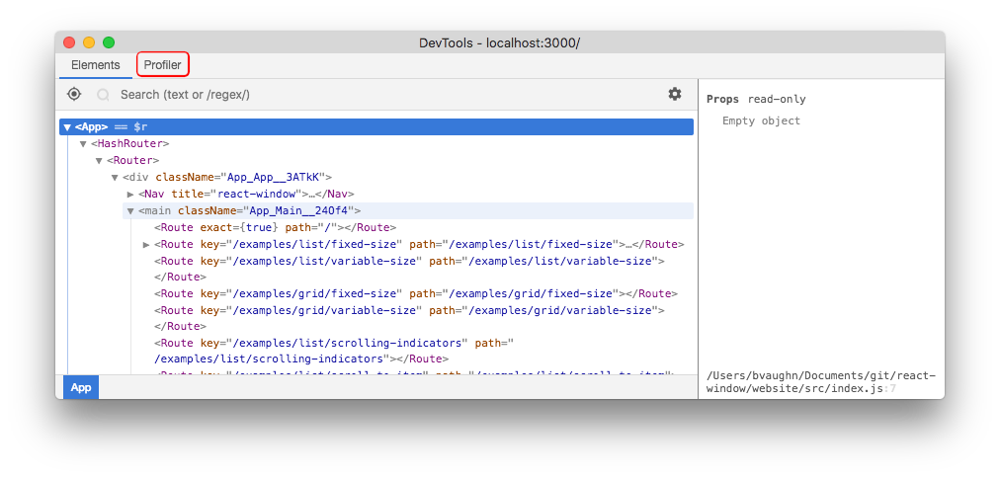

> Note:
>
> `react-dom` 16.5+ supports profiling in DEV mode.
> A production profiling bundle is also available as `react-dom/profiling`.
> Read more about how to use this bundle at [fb.me/react-profiling](https://fb.me/react-profiling) 

The "Profiler" panel will be empty initially. Click the record button to start profiling:

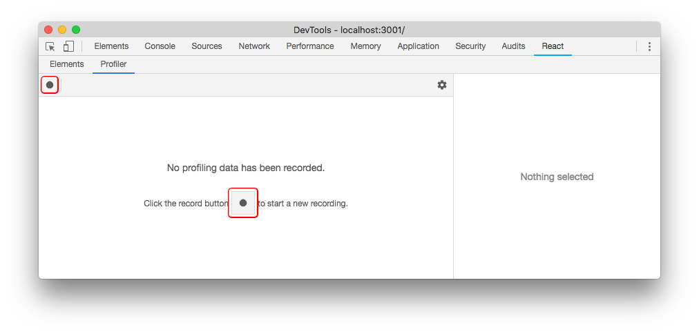

Once you've started recording, DevTools will automatically collect performance information each time your application renders.
Use your app as you normally would.
When you are finished profiling, click the "Stop" button.

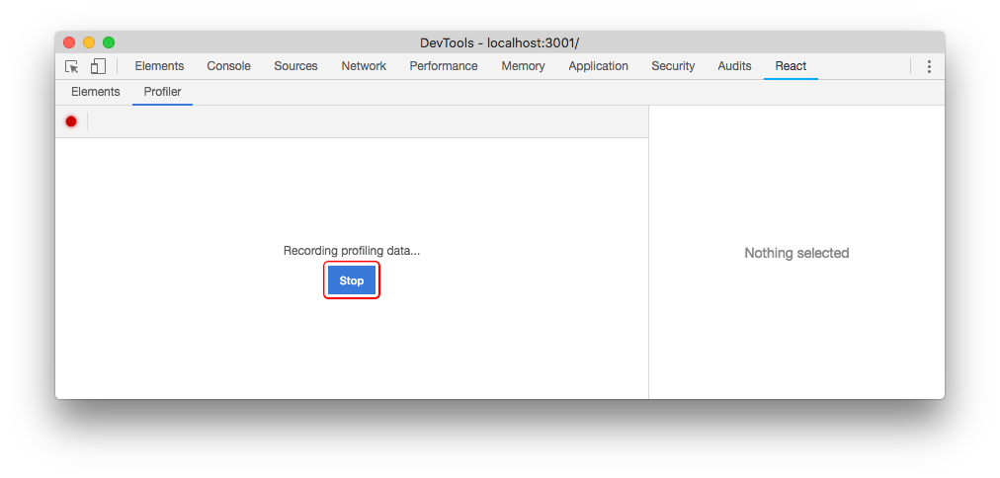

Assuming your application rendered at least once while profiling, DevTools will show several ways to view the performance data.
We'll [take a look at each of these below](#reading-performance-data).

## Reading performance data {#reading-performance-data}

### Browsing commits {#browsing-commits}
Conceptually, React does work in two phases:

* The **render** phase determines what changes need to be made to e.g. the DOM. During this phase, React calls `render` and then compares the result to the previous render.
* The **commit** phase is when React applies any changes. (In the case of React DOM, this is when React inserts, updates, and removes DOM nodes.) React also calls lifecycles like `componentDidMount` and `componentDidUpdate` during this phase.

The DevTools profiler groups performance info by commit.
Commits are displayed in a bar chart near the top of the profiler:

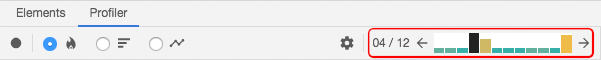

Each bar in the chart represents a single commit with the currently selected commit colored black.
You can click on a bar (or the left/right arrow buttons) to select a different commit.

The color and height of each bar corresponds to how long that commit took to render.
(Taller, yellow bars took longer than shorter, blue bars.)

### Filtering commits {#filtering-commits}

The longer you profile, the more times your application will render.
In some cases you may end up with _too many commits_ to easily process.
The profiler offers a filtering mechanism to help with this.
Use it to specify a threshold and the profiler will hide all commits that were _faster_ than that value.

### Flame chart {#flame-chart}

The flame chart view represents the state of your application for a particular commit.
Each bar in the chart represents a React component (e.g. `App`, `Nav`).
The size and color of the bar represents how long it took to render the component and its children.
(The width of a bar represents how much time was spent _when the component last rendered_ and the color represents how much time was spent _as part of the current commit_.)

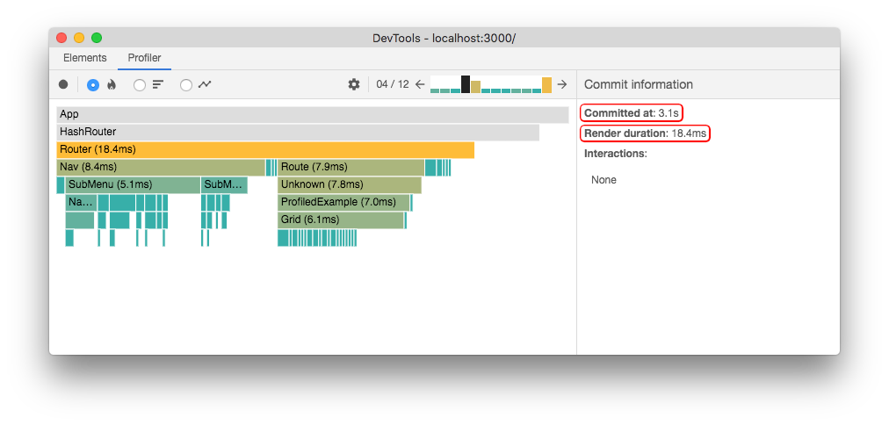

> Note:
>
> The width of a bar indicates how long it took to render the component (and its children) when they last rendered.
> If the component did not re-render as part of this commit, the time represents a previous render.
> The wider a component is, the longer it took to render.
> 
> The color of a bar indicates how long the component (and its children) took to render in the selected commit.
> Yellow components took more time, blue components took less time, and gray components did not render at all during this commit.

For example, the commit shown above took a total of 18.4ms to render.
The `Router` component was the "most expensive" to render (taking 18.4ms).
Most of this time was due to two of its children, `Nav` (8.4ms) and `Route` (7.9ms).
The rest of the time was divided between its remaining children or spent in the component's own render method.

You can zoom in or out on a flame chart by clicking on components:
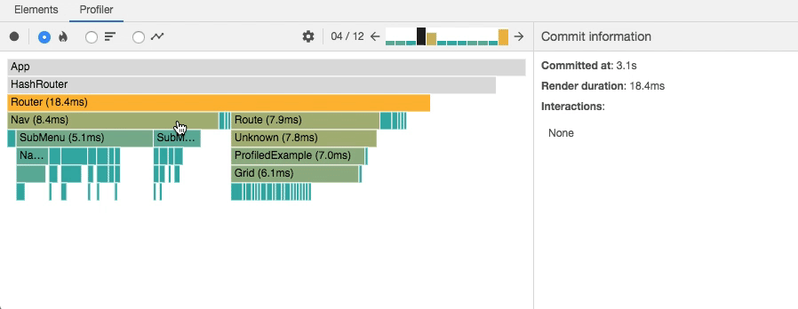

Clicking on a component will also select it and show information in the right side panel which includes its `props` and `state` at the time of this commit.
You can drill into these to learn more about what the component actually rendered during the commit:

In some cases, selecting a component and stepping between commits may also provide a hint as to _why_ the component rendered:

The above image shows that `state.scrollOffset` changed between commits.
This is likely what caused the `List` component to re-render.

### Ranked chart {#ranked-chart}

The ranked chart view represents a single commit.
Each bar in the chart represents a React component (e.g. `App`, `Nav`).
The chart is ordered so that the components which took the longest to render are at the top.

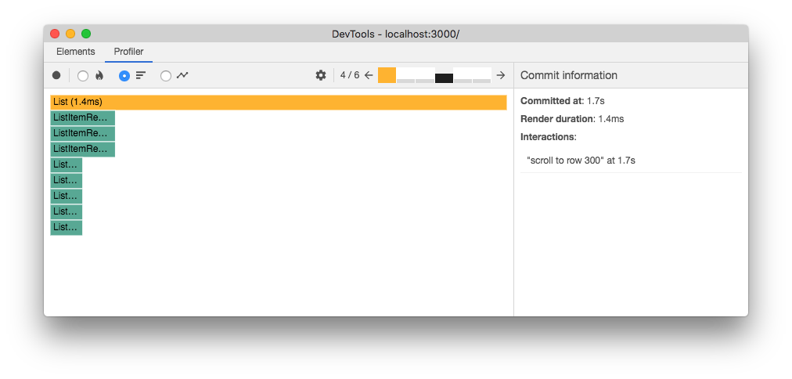

> Note:
>
> A component's render time includes the time spent rendering its children,
> so the components which took the longest to render are generally near the top of the tree.

As with the flame chart, you can zoom in or out on a ranked chart by clicking on components.

### Component chart {#component-chart}

Sometimes it's useful to see how many times a particular component rendered while you were profiling.
The component chart provides this information in the form of a bar chart.
Each bar in the chart represents a time when the component rendered.
The color and height of each bar corresponds to how long the component took to render _relative to other components_ in a particular commit.

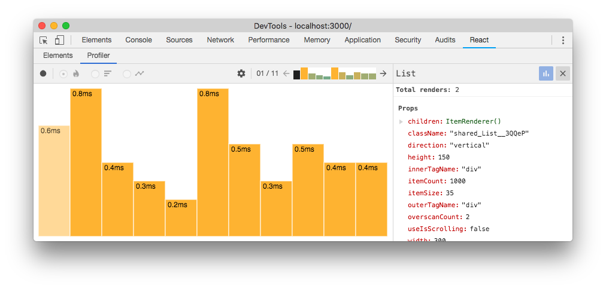

The chart above shows that the `List` component rendered 11 times.
It also shows that each time it rendered, it was the most "expensive" component in the commit (meaning that it took the longest).

To view this chart, either double-click on a component _or_ select a component and click on the blue bar chart icon in the right detail pane.
You can return to the previous chart by clicking the "x" button in the right detail pane.
You can also double click on a particular bar to view more information about that commit.

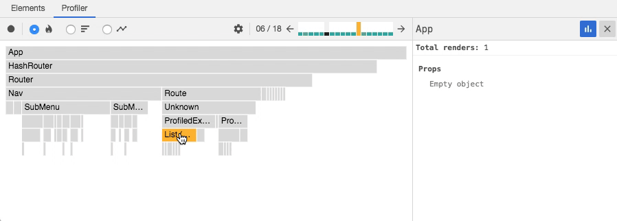

If the selected component did not render at all during the profiling session, the following message will be shown:

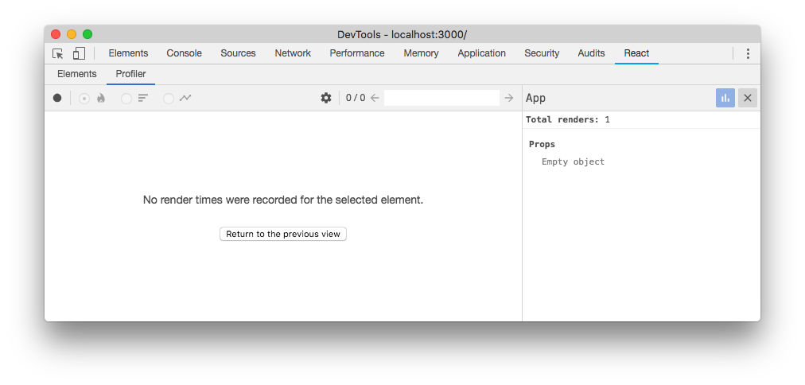

### Interactions {#interactions}

React recently added another [experimental API](https://fb.me/react-interaction-tracing) for tracing the _cause_ of an update.
"Interactions" traced with this API will also be shown in the profiler:

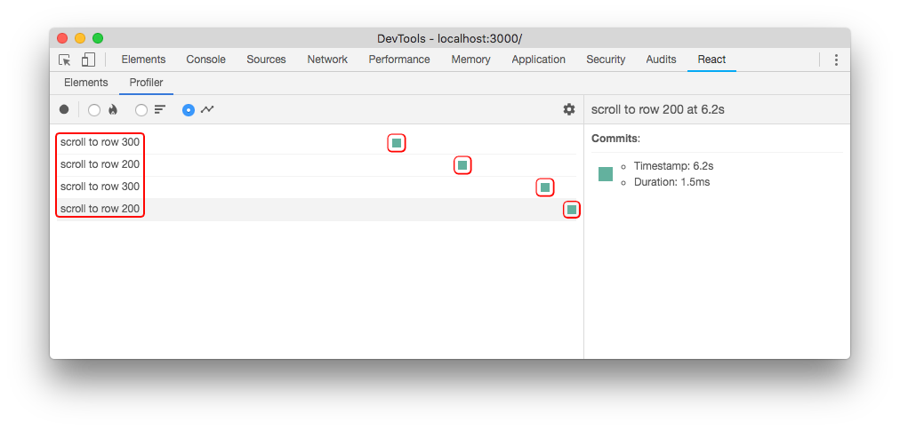

The image above shows a profiling session that traced four interactions.
Each row represents an interaction that was traced.
The colored dots along the row represent commits that were related to that interaction.

You can also see which interactions were traced for a particular commit from the flame chart and ranked chart views as well:

You can navigate between interactions and commits by clicking on them:

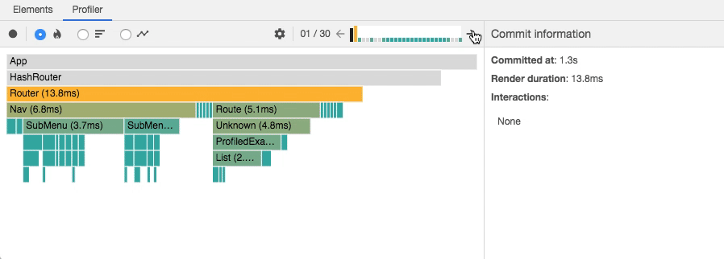

The tracing API is still new and we will cover it in more detail in a future blog post.

## Troubleshooting {#troubleshooting}

### No profiling data has been recorded for the selected root {#no-profiling-data-has-been-recorded-for-the-selected-root}

If your application has multiple "roots", you may see the following message after profiling:
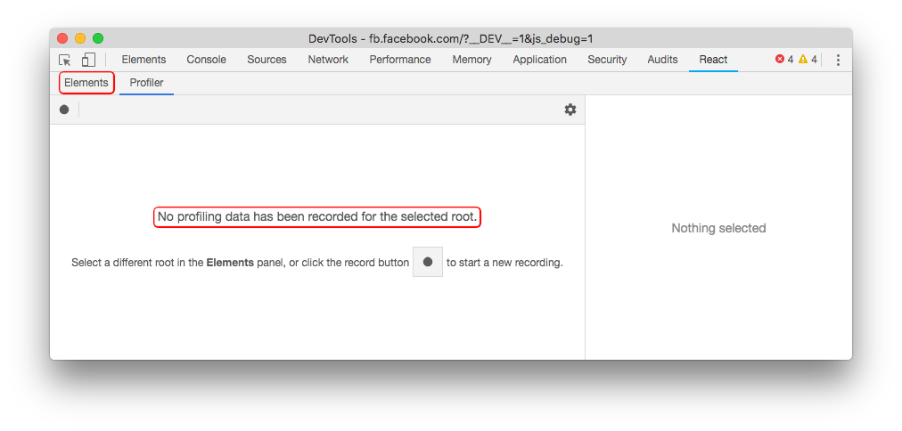

This message indicates that no performance data was recorded for the root that's selected in the "Elements" panel.
In this case, try selecting a different root in that panel to view profiling information for that root:

### No timing data to display for the selected commit {#no-timing-data-to-display-for-the-selected-commit}

Sometimes a commit may be so fast that `performance.now()` doesn't give DevTools any meaningful timing information.
In this case, the following message will be shown:

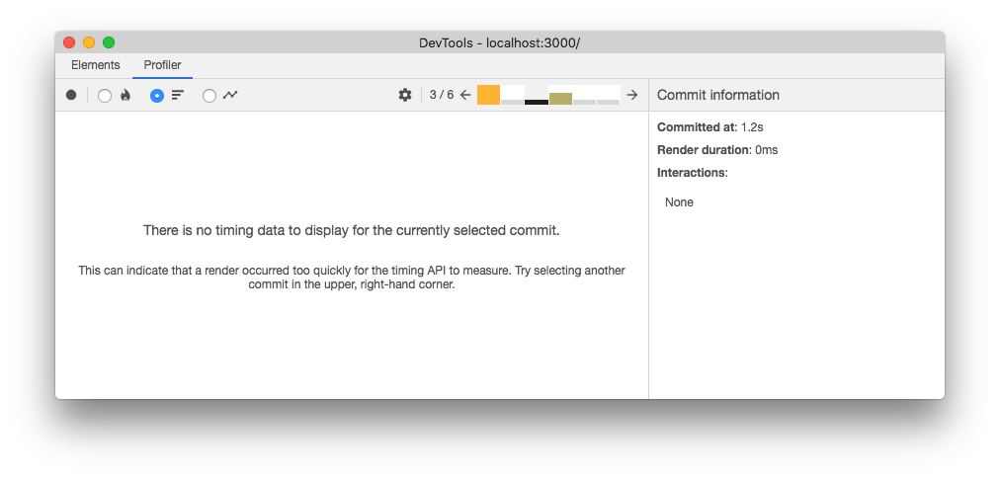

## Deep dive video {#deep-dive-video}

The following video demonstrates how the React profiler can be used to detect and improve performance bottlenecks in an actual React application.

 

<iframe width="560" height="315" src="https://www.youtube-nocookie.com/embed/nySib7ipZdk?rel=0" frameborder="0" allow="autoplay; encrypted-media" allowfullscreen></iframe>
