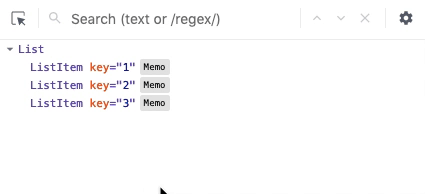

We are excited to announce a new release of the React developer tools, available today in supported browsers!

## What's changed?

A lot has changed!
[Check out the changelog](https://github.com/bvaughn/react-devtools-experimental/blob/master/CHANGELOG.md) for a complete list.
At a high level, this new version should offer significant performance gains and an improved navigation experience.

## Which versions of React are supported?

**`react-dom`**

* `0`-`14.x`: Not supported
* `15.x`: Partial (component filters not supported)
* `16.x`: Supported

**`react-native`**
* `0`-`0.60`: Not supported
* `0.61`: Supported

## How do I get the new DevTools?

For those of you using DevTools in Chrome or Firefox, the extension should update automatically within the next couple of hours.

Standalone users (e.g. React Native or Safari) can install the new version from NPM:

```shell
npm install -g react-devtools@^4
```

## Where did all of the DOM elements go?

The new DevTools provides a way to filter components from the tree to make it easier to navigate large applications.
Host nodes (e.g. HTML `<div>`, React Native `<View>`) are *hidden by default*, but this filter can be disabled:



## How do I get the old version back?

If you are working with React Native version 60 (or older) you can install the previous release of DevTools from NPM:

```shell
npm install --dev react-devtools@^3
```

For older versions of React DOM (v14 or earlier) you will need to build the extension from source:

```shell
# Checkout the extension source
git clone https://github.com/facebook/react-devtools

cd react-devtools

# Install dependencies and build the unpacked extension
yarn install
yarn build:extension

# Follow the on-screen instructions for installation
```