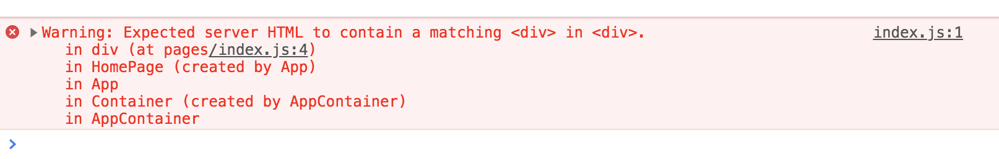

Today we are releasing React 16.13.0. It contains bugfixes and new deprecation warnings to help prepare for a future major release.

## New Warnings {#new-warnings}

### Warnings for some updates during render {#warnings-for-some-updates-during-render}

A React component should not cause side effects in other components during rendering.

It is supported to call `setState` during render, but [only for *the same component*](/docs/hooks-faq.html#how-do-i-implement-getderivedstatefromprops). If you call `setState` during a render on a different component, you will now see a warning:

```
Warning: Cannot update a component from inside the function body of a different component.
```

**This warning will help you find application bugs caused by unintentional state changes.** In the rare case that you intentionally want to change the state of another component as a result of rendering, you can wrap the `setState` call into `useEffect`.

### Warnings for conflicting style rules

When dynamically applying a `style` that contains longhand and shorthand versions of CSS properties, particular combinations of updates can cause inconsistent styling. For example: 

```js
<div style={toggle ? 
  { background: 'blue', backgroundColor: 'red' } : 
  { backgroundColor: 'red' }
}>
  ...
</div> 
```

You might expect this `<div>` to always have a red background, no matter the value of `toggle`. However, on alternating the value of `toggle` between `true` and `false`, the background color start as `red`, then alternates between `transparent` and `blue`, [as you can see in this demo](https://codesandbox.io/s/suspicious-sunset-g3jub).
  
**React now detects conflicting style rules and logs a warning.** To fix the issue, don't mix shorthand and longhand versions of the same CSS property in the `style` prop.

### Warnings for some deprecated string refs {#warnings-for-some-deprecated-string-refs}

[String Refs is an old legacy API](/docs/refs-and-the-dom.html#legacy-api-string-refs) which is discouraged and is going to be deprecated in the future:

```js
<Button ref="myRef" />
```

(Don't confuse String Refs with refs in general, which **remain fully supported**.)

In the future, we will provide an automated script (a "codemod") to migrate away from String Refs. However, some rare cases can't be migrated automatically. This release adds a new warning **only for those cases** in advance of the deprecation.

For example, it will fire if you use String Refs together with the Render Prop pattern:

```jsx
class ClassWithRenderProp extends React.Component {
  componentDidMount() {
    doSomething(this.refs.myRef);
  }
  render() {
    return this.props.children();
  }
}

class ClassParent extends React.Component {
  render() {
    return (
      <ClassWithRenderProp>
        {() => <Button ref="myRef" />}
      </ClassWithRenderProp>
    );
  }
}
```

Code like this often indicates bugs. (You might expect the ref to be available on `ClassParent`, but instead it gets placed on `ClassWithRenderProp`).

**You most likely don't have code like this**. If you do and it is intentional, convert it to [`React.createRef()`](/docs/refs-and-the-dom.html#creating-refs) instead:

```jsx
class ClassWithRenderProp extends React.Component {
  myRef = React.createRef();
  componentDidMount() {
    doSomething(this.myRef.current);
  }
  render() {
    return this.props.children(this.myRef);
  }
}

class ClassParent extends React.Component {
  render() {
    return (
      <ClassWithRenderProp>
        {myRef => <Button ref={myRef} />}
      </ClassWithRenderProp>
    );
  }
}
```

> Note
>
> To see this warning, you need to have the [babel-plugin-transform-react-jsx-self](https://babeljs.io/docs/en/babel-plugin-transform-react-jsx-self) installed in your Babel plugins. It must _only_ be enabled in development mode. 
> 
> If you use Create React App or have the "react" preset with Babel 7+, you already have this plugin installed by default.

### Deprecating `React.createFactory` {#deprecating-reactcreatefactory}

[`React.createFactory`](/docs/react-api.html#createfactory) is a legacy helper for creating React elements. This release adds a deprecation warning to the method. It will be removed in a future major version.

Replace usages of `React.createFactory` with regular JSX. Alternately, you can copy and paste this one-line helper or publish it as a library:

```jsx
let createFactory = type => React.createElement.bind(null, type);
```

It does exactly the same thing.

### Deprecating `ReactDOM.unstable_createPortal` in favor of `ReactDOM.createPortal` {#deprecating-reactdomunstable_createportal-in-favor-of-reactdomcreateportal}

When React 16 was released, `createPortal` became an officially supported API.

However, we kept `unstable_createPortal` as a supported alias to keep the few libraries that adopted it working. We are now deprecating the unstable alias. Use `createPortal` directly instead of `unstable_createPortal`. It has exactly the same signature.

## Other Improvements {#other-improvements}

### Component stacks in hydration warnings {#component-stacks-in-hydration-warnings}

React adds component stacks to its development warnings, enabling developers to isolate bugs and debug their programs. This release adds component stacks to a number of development warnings that didn't previously have them. As an example, consider this hydration warning from the previous versions:


While it's pointing out an error with the code, it's not clear where the error exists, and what to do next. This release adds a component stack to this warning, which makes it look like this:



This makes it clear where the problem is, and lets you locate and fix the bug faster. 

### Notable bugfixes {#notable-bugfixes}

This release contains a few other notable improvements:

- In Strict Development Mode, React calls lifecycle methods twice to flush out any possible unwanted side effects. This release adds that behaviour to `shouldComponentUpdate`. This shouldn't affect most code, unless you have side effects in `shouldComponentUpdate`. To fix this, move the code with side effects into `componentDidUpdate`.

- In Strict Development Mode, the warnings for usage of the legacy context API didn't include the stack for the component that triggered the warning. This release adds the missing stack to the warning.

- `onMouseEnter` now doesn't trigger on disabled `<button>` elements.

- ReactDOM was missing a `version` export since we published v16. This release adds it back. We don't recommend using it in your application logic, but it's useful when debugging issues with mismatching / multiple versions of ReactDOM on the same page.

We’re thankful to all the contributors who helped surface and fix these and other issues. You can find the full changelog [below](#changelog).

## Installation {#installation}

### React {#react}

React v16.13.0 is available on the npm registry.

To install React 16 with Yarn, run:

```bash
yarn add react@^16.13.0 react-dom@^16.13.0
```

To install React 16 with npm, run:

```bash
npm install --save react@^16.13.0 react-dom@^16.13.0
```

We also provide UMD builds of React via a CDN:

```html
<script crossorigin src="https://unpkg.com/react@16/umd/react.production.min.js"></script>
<script crossorigin src="https://unpkg.com/react-dom@16/umd/react-dom.production.min.js"></script>
```

Refer to the documentation for [detailed installation instructions](/docs/installation.html).

## Changelog {#changelog}

### React {#react}

- Warn when a string ref is used in a manner that's not amenable to a future codemod ([@lunaruan](https://github.com/lunaruan) in [#17864](https://github.com/facebook/react/pull/17864))
- Deprecate `React.createFactory()` ([@trueadm](https://github.com/trueadm) in [#17878](https://github.com/facebook/react/pull/17878))

### React DOM {#react-dom}

- Warn when changes in `style` may cause an unexpected collision ([@sophiebits](https://github.com/sophiebits) in [#14181](https://github.com/facebook/react/pull/14181), [#18002](https://github.com/facebook/react/pull/18002))
- Warn when a function component is updated during another component's render phase ([@acdlite](<(https://github.com/acdlite)>) in [#17099](https://github.com/facebook/react/pull/17099))
- Deprecate `unstable_createPortal` ([@trueadm](https://github.com/trueadm) in [#17880](https://github.com/facebook/react/pull/17880))
- Fix `onMouseEnter` being fired on disabled buttons ([@AlfredoGJ](https://github.com/AlfredoGJ) in [#17675](https://github.com/facebook/react/pull/17675))
- Call `shouldComponentUpdate` twice when developing in `StrictMode` ([@bvaughn](https://github.com/bvaughn) in [#17942](https://github.com/facebook/react/pull/17942))
- Add `version` property to ReactDOM ([@ealush](https://github.com/ealush) in [#15780](https://github.com/facebook/react/pull/15780))
- Don't call `toString()` of `dangerouslySetInnerHTML` ([@sebmarkbage](https://github.com/sebmarkbage) in [#17773](https://github.com/facebook/react/pull/17773))
- Show component stacks in more warnings ([@gaearon](https://github.com/gaearon) in [#17922](https://github.com/facebook/react/pull/17922), [#17586](https://github.com/facebook/react/pull/17586))

### Concurrent Mode (Experimental) {#concurrent-mode-experimental}

- Warn for problematic usages of `ReactDOM.createRoot()` ([@trueadm](https://github.com/trueadm) in [#17937](https://github.com/facebook/react/pull/17937))
- Remove `ReactDOM.createRoot()` callback params and added warnings on usage ([@bvaughn](https://github.com/bvaughn) in [#17916](https://github.com/facebook/react/pull/17916))
- Don't group Idle/Offscreen work with other work ([@sebmarkbage](https://github.com/sebmarkbage) in [#17456](https://github.com/facebook/react/pull/17456))
- Adjust `SuspenseList` CPU bound heuristic ([@sebmarkbage](https://github.com/sebmarkbage) in [#17455](https://github.com/facebook/react/pull/17455))
- Add missing event plugin priorities ([@trueadm](https://github.com/trueadm) in [#17914](https://github.com/facebook/react/pull/17914))
- Fix `isPending` only being true when transitioning from inside an input event ([@acdlite](https://github.com/acdlite) in [#17382](https://github.com/facebook/react/pull/17382))
- Fix `React.memo` components dropping updates when interrupted by a higher priority update ([@acdlite](<(https://github.com/acdlite)>) in [#18091](https://github.com/facebook/react/pull/18091))
- Don't warn when suspending at the wrong priority ([@gaearon](https://github.com/gaearon) in [#17971](https://github.com/facebook/react/pull/17971))
- Fix a bug with rebasing updates ([@acdlite](https://github.com/acdlite) and [@sebmarkbage](https://github.com/sebmarkbage) in [#17560](https://github.com/facebook/react/pull/17560), [#17510](https://github.com/facebook/react/pull/17510), [#17483](https://github.com/facebook/react/pull/17483), [#17480](https://github.com/facebook/react/pull/17480))
