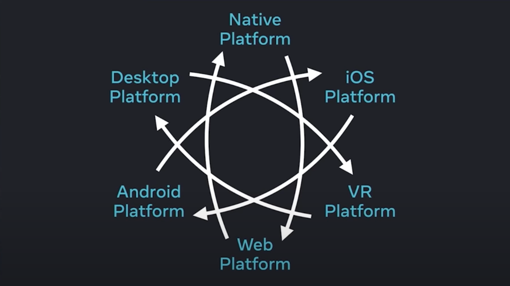

On December 8th, we hosted our 6th [React Conf](https://conf.reactjs.org/). 50,000 participants registered for the first virtual React conf, which was hosted over a YouTube Live stream and a Discord text server.

**Some quick stats:**

* We streamed the event twice to accommodate community members in different time zones. 6,900 viewers for the Live event and 5,800 viewers for the Replay event ten hours after the Live event.
* 61,000 people watched the talks after the event on [YouTube](https://www.youtube.com/channel/UC1hOCRBN2mnXgN5reSoO3pQ/videos).
* 5,700 members participated in the live discussion via our [Discord server](https://discord.gg/JVtWJyagJw).
* 8 languages were officially supported with professional video captioning and multilingual moderators to accommodate the global React community. React Conf was available in Arabic, Spanish, Hindi, Japanese, Portuguese, Russian, Chinese, and English.
* A team of moderators were brought in to enforce the [Code of Conduct](https://github.com/facebook/react/blob/main/CODE_OF_CONDUCT.md) at the event.

In previous years, we've used the React Conf stage to deliver industry changing announcements such as [React Native](https://engineering.fb.com/2015/03/26/android/react-native-bringing-modern-web-techniques-to-mobile/) and [React Hooks](https://reactjs.org/docs/hooks-intro.html). This year, we shared our multi-platform vision for React, starting with the release of **React 18** and the **concurrent rendering engine**.

After [piloting React 18](https://engineering.fb.com/2020/05/08/web/facebook-redesign/) with select teams at Meta, and are excited to announce that we're ready to share React 18 with a wider audience. We are releasing the React 18 RC to open source so that members of the React community can begin using the new concurrent rendering engine today.

This release is a milestone of years of collaborative research between the React, React Native, and React Data teams. With this release we're rolling out features that power the [facebook.com](https://www.facebook.com/) site and set the foundation for upcoming features such as **Server Components** and **React Native pre-rendering**.

We also shared how we're raising the bar across many platforms with our [many platform vision](https://reactnative.dev/blog/2021/08/26/many-platform-vision). The foundation set by React 18 will power our investment into platforms such as Desktop and VR.

## Here are some key highlights from the conference {#key-highlights-from-conf}

* **React 18 RC:** We announced React 18, the foundation for the future of React. This release includes the **new concurrent renderer** that powers the [facebook.com](http://facebook.com/) site, **Suspense** , and many upcoming features such as **Server Components** , and **React Native pre-rendering**. Learn more at [Andrew Clark](https://twitter.com/acdlite) and [Juan Tejada's](https://twitter.com/_jstejada) talk in the [React 18 Keynote](https://www.youtube.com/watch?v=FZ0cG47msEk).
* **Gradual Migration:** We were excited to announce our new gradual migration strategy for React 18 and our new concurrent renderer. We previously considered a "mode" that would opt entire apps into concurrent rendering. But with React 18, there's no concurrent mode, only concurrent features. You get concurrency when you opt-in by using new concurrent features. Learn more at [Lauren Tan's](https://twitter.com/sugarpirate_) talk in the [React 18 Keynote](https://www.youtube.com/watch?v=FZ0cG47msEk).
* **Many platform vision:** We shared our many-platform vision for React. We explained how our work building apps in React Native on Android and iOS led directly to Concurrent Rendering and how our research into web features such as code-splitting and date fetching led to Suspense. By building React for every platform, we benefit each platform. Learn more at [Rick Hanlon's](https://twitter.com/rickhanlonii) talk in the [React 18 Keynote](https://www.youtube.com/watch?v=FZ0cG47msEk).
* **New DevTools Timeline Profiler:** We've also developed a new timeline profiler for DevTools to help users better understand what's happening in their React apps. The new profiler has first-class support for new features such as [Suspense](https://github.com/reactwg/react-18/discussions/7) and [useDeferredValue](https://github.com/facebook/react/pull/21488), and includes warnings for common performance issues. Learn more at [Brian Vaughn's](https://twitter.com/brian_d_vaughn) talk about [React Developer Tooling](https://www.youtube.com/watch?v=oxDfrke8rZg).
* **New Docs:** We released our new docs at [beta.reactjs.org](https://beta.reactjs.org/). These docs are written hooks-first and teach users how to think about React, not just what the APIs are. They include guides, illustrations, challenges, recipes and more to help developers from beginners to seasoned developers. Learn more at [Rachel Nabors'](https://twitter.com/rachelnabors) talk in the [React Docs Keynote](https://www.youtube.com/watch?v=mneDaMYOKP8), and watch React community member [Debbie O'Brien](https://twitter.com/debs_obrien) talk about [things she learnt from the new React docs](https://www.youtube.com/watch?v=-7odLW_hG7s).

## We also shared these updates {#updates}

* **Suspense:** In React 18 we re-introduced Suspense with our vision to be more than just a way to specify loading placeholders. Suspense is a way to define async data dependencies declaratively, and with React 18, content can now be rendered concurrently and streamed from the server. Learn more at [Juan Tejada's](https://twitter.com/_jstejada) talk in the [React 18 Keynote](https://www.youtube.com/watch?v=FZ0cG47msEk).
* **Streaming Server-side Rendering:** React 18 also comes with support for Suspense on the server, which enables our new server-side streaming rendering engine. This feature allows apps to begin downloading and hydrating the client-side while data is still being fetched and rendered server-side by using Suspense boundaries to decide when it's safe to stream. Learn more at [Shaundai Person's](https://twitter.com/shaundai) talk about [Streaming Server Rendering with Suspense](https://www.youtube.com/watch?v=pj5N-Khihgc).
* **New APIs:** In React 18 we released a number of new APIs primarily targeted towards library authors who need more lower-level control to support React 18. New APIs include [useId](https://github.com/reactwg/react-18/discussions/111), [useSyncExternalStore](https://github.com/reactwg/react-18/discussions/86), and [useIntertionEffect](https://github.com/facebook/react/pull/21913). Additionally, we're open-sourcing APIs that are already heavily used at Meta, such as [createRoot](https://github.com/reactwg/react-18/discussions/5), [useTransition](https://github.com/facebook/react/pull/21488), and [useDeferredValue](https://github.com/facebook/react/pull/21488). Learn more at [Daishi Kato's](https://twitter.com/dai_shi) talk about [React 18 for External Store Libraries](https://www.youtube.com/watch?v=oPfSC5bQPR8).
* **New Working Groups:** We launched our first public [Working Group](https://github.com/reactwg/react-18) to help ship our gradual adoption strategy for React 18. It was key to our success for React 18, leading directly to changes to many of the APIs mentioned above. We also announced a new public working groups for [Server Components](https://github.com/reactwg/server-components). Learn more at [Aakansha Doshi's](https://twitter.com/aakansha1216) talk about [The First React Working Group](https://www.youtube.com/watch?v=qn7gRClrC9U). Additionally, [Shruti Kapoor](https://twitter.com/shrutikapoor08), a member of the React 18 Working Group, went over what's new in React 18, how to upgrade to React 18, and demoed upgrading to React 18 on a clone of an [existing Kanban board app](https://github.com/oldboyxx/jira_clone). Watch the full talk at [React 18 for app developers](https://www.youtube.com/watch?v=ytudH8je5ko).
* **Auto-memoization:** We shared an update on the research we've been doing into auto-memoization to provide out-of-the-box perf wins using a compiler for React. Learn more at [Xuan Huang's](https://twitter.com/Huxpro) talk about [React without memo](https://www.youtube.com/watch?v=lGEMwh32soc).

## We heard from partner teams and members of the React community {#partner-teams}

* [Sarah Rainsberger](https://twitter.com/sarah11918) talked about learning, building, and maintaining React code using [nothing but a web browser](https://www.youtube.com/watch?v=5X-WEQflCL0).
* [Linton Ye](https://twitter.com/lintonye) talked about [The ROI of Designing with React](https://www.youtube.com/watch?v=7cPWmID5XAk). Check out his [resource](https://learnreact.design/) for learning React for designers and visual learners.
* [Delba de Oliveira](https://twitter.com/delba_oliveira) brought her expertise as a developer advocate at Vercel and shared insights about leveraging accessibility and interactivity to design [joyful playgrounds with React](https://www.youtube.com/watch?v=zL8cz2W0z34). She shared some of her favourite interactive learning React sites, listed on her website [here](https://delba.dev/blog/interactive-playgrounds).
* [Robert Balicki](https://twitter.com/StatisticsFTW) re-introduced [Relay](https://relay.dev/) to open source by showing [how Relay works with new concurrent features like Suspense](https://www.youtube.com/watch?v=lhVGdErZuN4) and [unveiling the new Rust compiler](https://relay.dev/blog/2021/12/08/introducing-the-new-relay-compiler/).
* [Eric Rozelle](https://twitter.com/EricRozell) and [Steven Moyes](https://twitter.com/moyessa) shared [performance wins](https://www.youtube.com/watch?v=9L4FFrvwJwY) from rewriting Facebook Messenger in React Native. Learn more about React Native support for the Windows SDK and the macOS 10.14 SDK [here](https://microsoft.github.io/react-native-windows/).
* [Roman Rädle](https://twitter.com/raedle) performed a [live demo](https://www.youtube.com/watch?v=NLj73vrc2I8) building a machine-learning app in React Native using [PyTorch Live](https://pytorch.org/live/). He demonstrated PyTorch Live's offerings to empower mobile developers to build AI-powered experiences in minutes.
* [Diego Haz](https://twitter.com/diegohaz) demoed how to leverage the new asynchronous rendering feature in React 18 to [build accessible components](https://www.youtube.com/watch?v=dcm8fjBfro8).
* [Tafu Nakazaki](https://twitter.com/hawaiiman0) shared the challenges of processing complex administrative documents using vanilla JavaScript and how he [used React to improve ease of use for these forms](https://www.youtube.com/watch?v=S4a0QlsH0pU).
* [Lyle Troxell](https://twitter.com/lyle) talked about how he [designed the Netflix Studio UI](https://www.youtube.com/watch?v=b3l4WxipFsE) to accelerate artist workflows. Check out the source code from his talk [here](https://github.com/lyle/react-conf-2021), and the [Netflix Tech Blog](https://netflixtechblog.com/tagged/react) for ways React is used at Netflix.
* [Helen Lin](https://twitter.com/wizardlyhel) shared the challenges of building an e-commerce site like Shopify and how she used Hydrogen, a React framework, for [building custom storefronts on Shopify](https://www.youtube.com/watch?v=HS6vIYkSNks). Get a sneak peek developer preview of Hydrogen [here](https://hydrogen.new/).

You can find all the talks on the [YouTube playlist](https://www.youtube.com/channel/UC1hOCRBN2mnXgN5reSoO3pQ/videos) and follow all the speakers and their work [here](https://twitter.com/i/lists/1468722685165256706/members).

If you're new to React, get started on your React journey [here](https://reactjs.org/) and join the dev community on [GitHub](https://github.com/facebook/react/).
