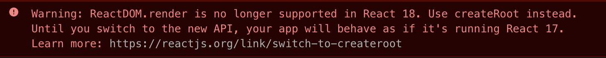

Today we’re publishing the second release candidate for React 18. With this release, we’re encouraging users to install and test React 18 to [raise any issues](https://github.com/facebook/react/issues/new/choose) for any problems you encounter in the upgrade before we publish the full stable release.

As we shared at [React Conf](https://reactjs.org/blog/2021/12/17/react-conf-2021-recap.html), React 18 will include our new concurrent renderer and a gradual migration strategy for concurrent features. React 18 also includes a small number of breaking changes and features outside of concurrent rendering. In this post we will describe the changes to expect when upgrading to React 18.

*Note for React Native users: React 18 will ship in React Native with the New React Native Architecture. For more information, see the [React Conf keynote here](https://www.youtube.com/watch?v=FZ0cG47msEk&t=1530s).*

## Installing

To install the latest React 18 RC, use the `@rc` tag:

```bash
npm install react@rc react-dom@rc
```

Or if you’re using yarn:

```bash
yarn add react@rc react-dom@rc
```

## New Client Root APIs

When you first install React 18, you will see a warning in the console:



React 18 introduces a new root API which provides better ergonomics for managing roots. The new root API also enables the new concurrent renderer, which allows you to opt-into concurrent features.

To upgrade `ReactDOM.render`:

```js
// Before
const container = document.getElementById('app');
ReactDOM.render(<App tab="home" />, container);

// After
const container = document.getElementById('app');
const root = ReactDOM.createRoot(container);
root.render(<App tab="home" />);

```

We’ve also changed `unmountComponentAtNode` to `root.unmount`:

```js
// Before
unmountComponentAtNode(containter);

// After
root.unmount();
```

And removed the callback from `render`:

```js
// Before
const container = document.getElementById('app');
ReactDOM.render(<App tab="home" />, container, () => {
  console.log('rendered');
});

// After
function AppWithCallbackAfterRender() {
  useEffect(() => {
    console.log('rendered');
  });

  return <App tab="home" />
}

const container = document.getElementById('app');
const root = ReactDOM.createRoot(container);
root.render(<AppWithCallbackAfterRender />);
```

Finally, to upgrade `ReactDOM.hydrate`:

```js
// Before
const container = document.getElementById('app');
ReactDOM.hydrate(<App tab="home" />, container);

// After
const container = document.getElementById('app');
const root = ReactDOM.hydrateRoot(container, <App tab="home" />);
// Unlike with createRoot, you don't need a separate root.render() call here.
```

For more information, see the [working group discussion here](https://github.com/reactwg/react-18/discussions/5).

## Updates to Server Rendering APIs

In this release, we’re revamping our server rendering APIs to support Suspense on the server and Streaming SSR.

As part of these changes, the following APIs will continue working, but with limited support for Suspense. Instead of erroring, these APIs will server render the nearest fallback for any subtree that suspends, and retry rendering on the client:

* `renderToString`
* `renderToStaticMarkup`

For full support of Suspense on the server, React 18 introduces new recommended streaming APIs. These APIs will retry suspended Suspense boundaries on the server, streaming the server-rendered content to the client when it is available:

* `renderToPipeableStream`
* `renderToReadableStream`

These new streaming APIs replace the old streaming APIs, which are now deprecated and will warn:

* `renderToNodeStream`
* `renderToStaticNodeStream`

For more information on the changes to these APIs, see the working group post on [Upgrading to React 18 on the server](https://github.com/reactwg/react-18/discussions/22), a [deep dive on the new Suspense SSR Architecture](https://github.com/reactwg/react-18/discussions/37), and [Shaundai Person’s](https://twitter.com/shaundai) talk on [Streaming Server Rendering with Suspense](https://www.youtube.com/watch?v=pj5N-Khihgc) at React Conf 2021.

## Automatic Batching

React 18 adds out-of-the-box performance improvements by doing more batching by default. Batching is when React groups multiple state updates into a single re-render for better performance. Before React 18, we only batched updates inside React event handlers. Updates inside of promises, setTimeout, native event handlers, or any other event were not batched in React by default:

```js
// Before React 18 only React events were batched

function handleClick() {
  setCount(c => c + 1);
  setFlag(f => !f);
  // React will only re-render once at the end (that's batching!)
}

setTimeout(() => {
  setCount(c => c + 1);
  setFlag(f => !f);
  // React will render twice, once for each state update (no batching)
}, 1000);
```


Starting in React 18 with `createRoot`, all updates will be automatically batched, no matter where they originate from. This means that updates inside of timeouts, promises, native event handlers or any other event will batch the same way as updates inside of React events:

```js
// After React 18 updates inside of timeouts, promises,
// native event handlers or any other event are batched.

function handleClick() {
  setCount(c => c + 1);
  setFlag(f => !f);
  // React will only re-render once at the end (that's batching!)
}

setTimeout(() => {
  setCount(c => c + 1);
  setFlag(f => !f);
  // React will only re-render once at the end (that's batching!)
}, 1000);
```

This is a breaking change, but we expect this to result in less work rendering, and therefore better performance in your applications. To opt-out of automatic batching, you can use `ReactDOM.flushSync`:

```js
function handleClick() {
  flushSync(() => {
    setCounter(c => c + 1);
  });
  // React has updated the DOM by now
  flushSync(() => {
    setFlag(f => !f);
  });
  // React has updated the DOM by now
}
```

For more information, see the [Automatic batching deep dive](https://github.com/reactwg/react-18/discussions/21).

## New APIs for Libraries

In the React 18 Working Group we worked with library maintainers to create new APIs needed to support concurrent rendering for use cases specific to their use case in areas like styles, external stores, and accessibility. To support React 18, some libraries may need to switch to one of the following APIs:

* `useId` is a new hook for generating unique IDs on both the client and server, while avoiding hydration mismatches. This solves an issue that already exists in React 17 and below, but it's even more important in React 18 because of how our streaming server renderer delivers HTML out-of-order. For more information see the [useId post in the working group](https://github.com/reactwg/react-18/discussions/111).
* `useSyncExternalStore` is a new hook that allows external stores to support concurrent reads by forcing updates to the store to be synchronous. This new API is recommended for any library that integrates with state external to React. For more information, see the [useSyncExternalStore overview post](https://github.com/reactwg/react-18/discussions/70) and [useSyncExternalStore API details](https://github.com/reactwg/react-18/discussions/86).
* `useInsertionEffect` is a new hook that allows CSS-in-JS libraries to address performance issues of injecting styles in render. This hook will run after the DOM is mutated, but before layout effects read the new layout. This solves an issue that already exists in React 17 and below, but is even more important in React 18 because React yields to the browser during concurrent rendering, giving it a chance to recalculate layout. For more information, see the [Library Upgrade Guide for `<style>`](https://github.com/reactwg/react-18/discussions/110).

React 18 also introduces new APIs for concurrent rendering such as `startTransition` and `useDeferredValue`, which we will share more about in the upcoming stable release post.

## Updates to Strict Mode

In the future, we'd like to add a feature to React which would allow a component that unmounts to remount and restore the previous component state. This will give React better performance out-of-the-box, but requires components to be resilient to effects being mounted and destroyed multiple times in a component using the same state.

To help surface these issues, React 18 introduces a new feature to Strict Mode. This new feature will automatically unmount and remount every component in development, whenever a component mounts, restoring the previous state on the second mount.

Before this change, React would mount the component and create the effects:

```
* React mounts the component.
    * Layout effects are created.
    * Effect effects are created.
```

With Strict Mode in React 18, React will simulate unmounting and remounting the component:

```
* React mounts the component.
    * Layout effects are created.
    * Effect effects are created.
* React simulates unmounting the component.
    * Layout effects are destroyed.
    * Effects are destroyed.
* React simulates mounting the component with the previous state.
    * Layout effect setup code runs
    * Effect setup code runs
```

For more information, see the Working Group posts for [Adding Strict Effects to Strict Mode](https://github.com/reactwg/react-18/discussions/19) and [How to Support Strict Effects](https://github.com/reactwg/react-18/discussions/18).

## Configuring Your Testing Environment

When you first update your tests to use `createRoot`, you may see this warning in your test console:

> The current testing environment is not configured to support act(...)

To fix this, set `global.IS_REACT_ACT_ENVIRONMENT` to `true` before running your test:

```js
// In your test setup file
global.IS_REACT_ACT_ENVIRONMENT = true;
```

The purpose of the flag is to tell React that it's running in a unit test-like environment. React will log helpful warnings if you forget to wrap an update with `act`.

You can also set the flag to `false` to tell React that `act` isn't needed. This can be useful for end-to-end tests that simulate a full browser environment.

Eventually, we expect testing libraries will configure this for you automatically. For example, the next version of React Testing Library has built-in support for React 18 without any additional configuration.

[More background on the the `act` testing API and related changes](https://github.com/reactwg/react-18/discussions/102) is available in the Working Group.

## Dropping Support for Internet Explorer

In this release, React is dropping support for Internet Explorer, which is [going out of support on June 15, 2022](https://blogs.windows.com/windowsexperience/2021/05/19/the-future-of-internet-explorer-on-windows-10-is-in-microsoft-edge). We’re making this change now because new features introduced in React 18 are built using modern browser features such as microtasks which cannot be adequately polyfilled in IE.

If you need to support Internet Explorer we recommend you stay with React 17.

## Other Changes

* [Update to remove the "setState on unmounted component" warning](https://github.com/reactwg/react-18/discussions/82)
* [Suspense no longer requires a `fallback` prop to capture](https://github.com/reactwg/react-18/discussions/72)
* [Components can now render undefined](https://github.com/reactwg/react-18/discussions/75)
* [Deprecated renderSubtreeIntoContainer](https://github.com/facebook/react/pull/23355)
* [StrictMode updated to not silence double logging by default](https://github.com/reactwg/react-18/discussions/96)
