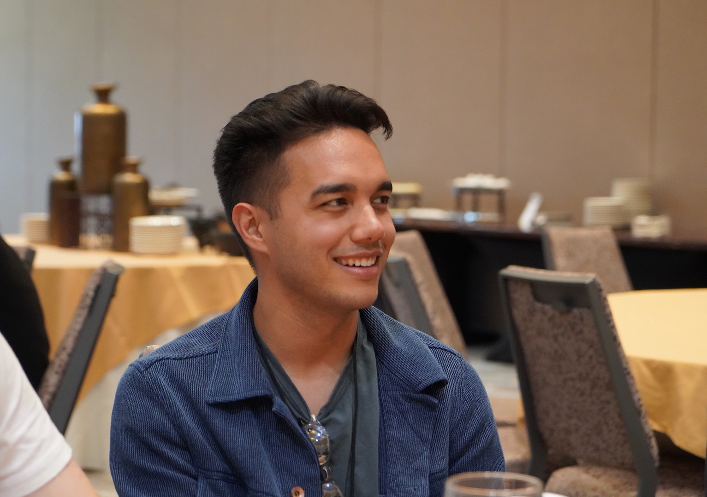
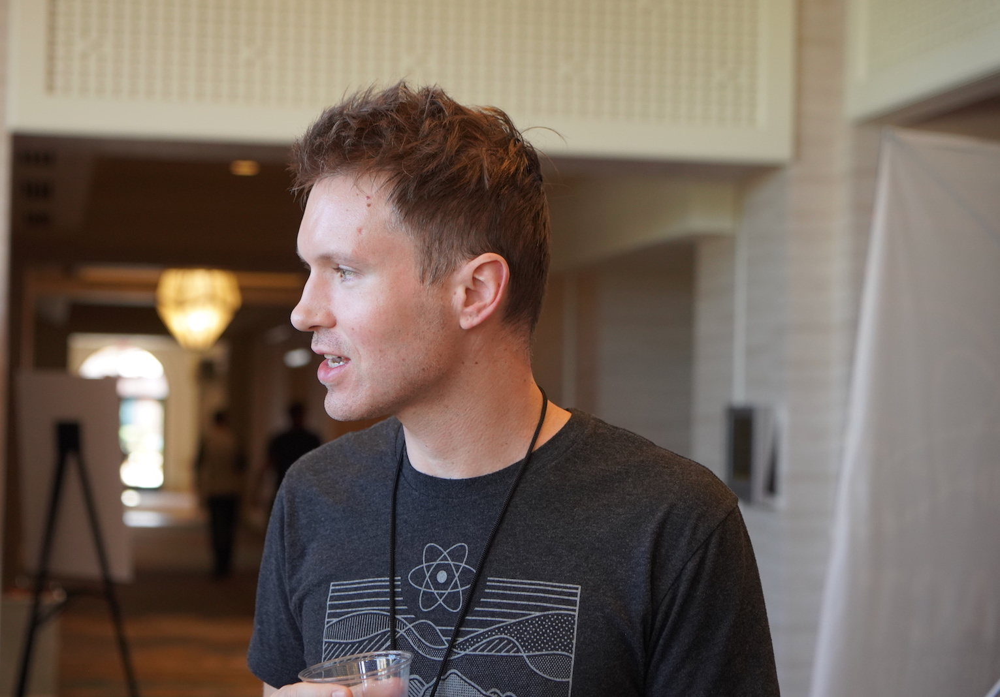
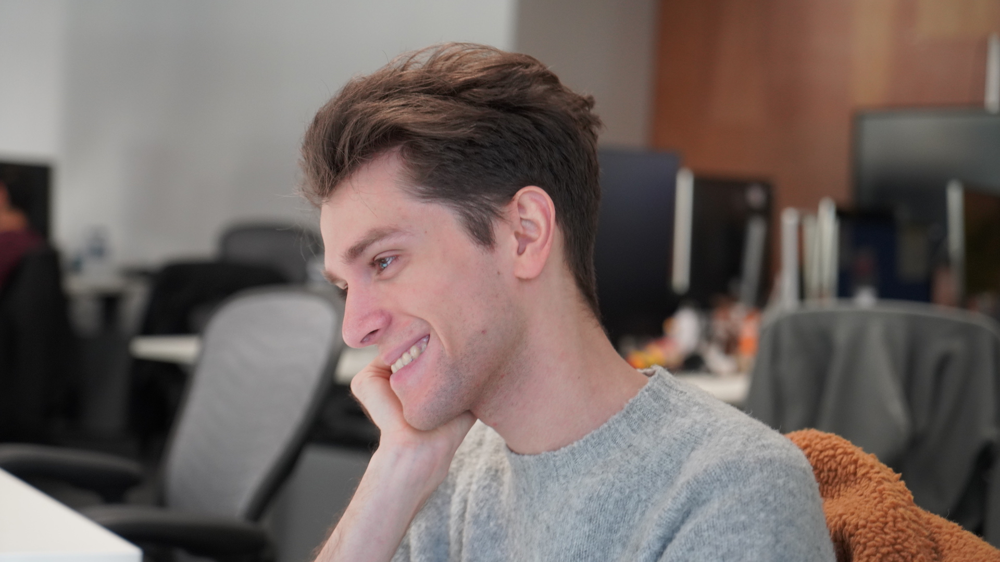
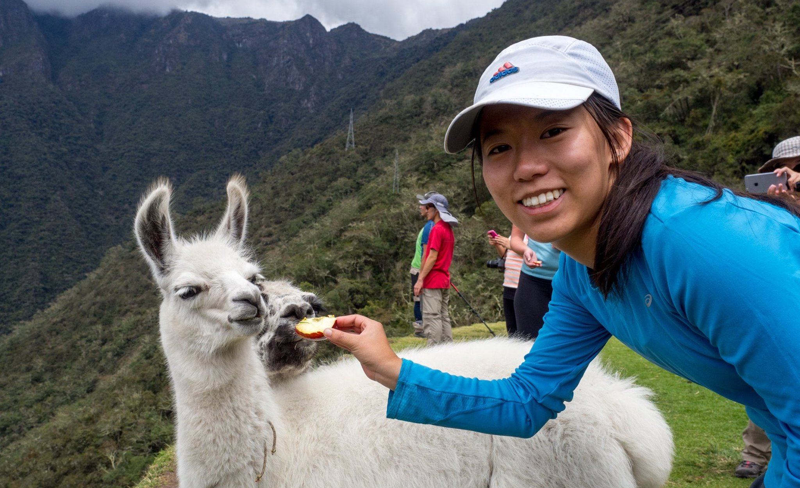

React development is led by a small dedicated team working full time at Facebook. It also receives contributions from people all over the world.

## Meet the React Team {#meet-the-react-team}

The React team members work full time on the core component APIs, the engine that powers React DOM and React Native, React DevTools, and the React documentation website.

Current members of the React team are listed in alphabetical order below.

### Andrew Clark {#andrew-clark}

[@acdlite on GitHub](https://github.com/acdlite) &middot; [@acdlite on Twitter](https://twitter.com/acdlite)

Andrew got started with web development by making sites with WordPress, and eventually tricked himself into doing JavaScript. His favorite pastime is karaoke. Andrew is either a Disney villain or a Disney princess, depending on the day.

### Brian Vaughn {#brian-vaughn}

[@bvaughn on GitHub](https://github.com/bvaughn) &middot; [@brian\_d\_vaughn on Twitter](https://twitter.com/brian_d_vaughn)

Brian studied art in college and did programming on the side to pay for his education. Eventually, he realized that he enjoys working on open source. Brian has one [one-person band](https://soundcloud.com/brianvaughn/) and two [two-person](https://soundcloud.com/pilotlessdrone) [bands](https://soundcloud.com/pinwurm). He also takes care of the cutest cat in the world.

### Dan Abramov {#dan-abramov}

[@gaearon on GitHub](https://github.com/gaearon) &middot; [@dan_abramov on Twitter](https://twitter.com/dan_abramov)

Dan got into programming after he accidentally discovered Visual Basic inside Microsoft PowerPoint. He has found his true calling in turning [Sebastian](#sebastian-markbage)'s tweets into long-form blog posts. Dan occasionally wins at Fortnite by hiding in a bush until the game ends.

### Dominic Gannaway {#dominic-gannaway}

[@trueadm on GitHub](https://github.com/trueadm) &middot; [@trueadm on Twitter](https://twitter.com/trueadm)

Dominic is interested in travelling, drum and bass, stand-up comedy and spending time with the family. He most enjoys hacking on new unexplored ideas around UIs and accessibility and has a passion for tweaking and optimizing code to get the most performance out of things.

### Luna Ruan {#luna-ruan}

[@lunaruan on GitHub](https://github.com/lunaruan) &middot; [@lunaruan on Twitter](https://twitter.com/lunaruan)

Luna learned programming because she thought it meant creating video games. Instead, she ended up working on the Pinterest web app, and now on React itself. Luna doesn't want to make video games anymore, but she plans to do creative writing if she ever gets bored.

### Rachel Nabors {#rachel-nabors}

[@rachelnabors on GitHub](https://github.com/rachelnabors) &middot; [@rachelnabors on Twitter](https://twitter.com/rachelnabors)

Rachel wrote a [book about UI animation](https://abookapart.com/products/animation-at-work) once and worked with MDN and the W3C on the web animations API. Now she is busy with education materials and community engineering on the React team. Secretly, she is an award-winning cartoonist for teenage girls. Catch her making fancy tea with lukewarm water in the microkitchen.

### Sebastian Markbåge {#sebastian-markbage}

[@sebmarkbage on GitHub](https://github.com/sebmarkbage) &middot; [@sebmarkbage on Twitter](https://twitter.com/sebmarkbage)

Sebastian majored in psychology. He's usually quiet. Even when he says something, it often doesn't make sense to the rest of us until a few months later. The correct way to pronounce his surname is "mark-boa-geh" but he settled for "mark-beige" out of pragmatism -- and that's how he approaches React.

### Yuzhi Zheng {#yuzhi-zheng}

[@yuzhi on GitHub](https://github.com/yuzhi) &middot; [@yuzhiz on Twitter](https://twitter.com/yuzhiz)

Yuzhi studied Computer Science in school. She liked the instant gratification of seeing code come to life without having to physically be in a laboratory. Now she manages the React team. Before management, she used to work on the Relay data fetching framework. In her spare time, Yuzhi enjoys optimizing her life via gardening and home improvement projects.

## Acknowledgements {#acknowledgements}

React was originally created by [Jordan Walke](https://github.com/jordwalke). Today, React has over a thousand open source contributors. We'd like to recognize a few people who have made significant contributions to React and its documentation in the past and have helped maintain them over the years:

* [Almero Steyn](https://github.com/AlmeroSteyn)
* [Andreas Svensson](https://github.com/syranide)
* [Alex Krolick](https://github.com/alexkrolick)
* [Alexey Pyltsyn](https://github.com/lex111)
* [Brandon Dail](https://github.com/aweary)
* [Caleb Meredith](https://github.com/calebmer)
* [Chang Yan](https://github.com/cyan33)
* [Cheng Lou](https://github.com/chenglou)
* [Christoph Nakazawa](https://github.com/cpojer)
* [Christopher Chedeau](https://github.com/vjeux)
* [Clement Hoang](https://github.com/clemmy)
* [Flarnie Marchan](https://github.com/flarnie)
* [Jason Quense](https://github.com/jquense)
* [Jesse Beach](https://github.com/jessebeach)
* [Jessica Franco](https://github.com/Jessidhia)
* [Jim Sproch](https://github.com/jimfb)
* [Josh Duck](https://github.com/joshduck)
* [Joe Critchley](https://github.com/joecritch)
* [Jeff Morrison](https://github.com/jeffmo)
* [Keyan Zhang](https://github.com/keyz)
* [Nat Alison](https://github.com/tesseralis)
* [Nathan Hunzaker](https://github.com/nhunzaker)
* [Nicolas Gallagher](https://github.com/necolas)
* [Paul O'Shannessy](https://github.com/zpao)
* [Pete Hunt](https://github.com/petehunt)
* [Philipp Spiess](https://github.com/philipp-spiess)
* [Sander Spies](https://github.com/sanderspies)
* [Sasha Aickin](https://github.com/aickin)
* [Sophia Shoemaker](https://github.com/mrscobbler)
* [Sophie Alpert](https://github.com/sophiebits)
* [Sunil Pai](https://github.com/threepointone)
* [Tim Yung](https://github.com/yungsters)

This list is not exhaustive.

We'd like to give special thanks to [Tom Occhino](https://github.com/tomocchino) and [Adam Wolff](https://github.com/wolffiex) for their guidance and support over the years. We'd also like to thank all the volunteers who [translated React into other languages](https://isreacttranslatedyet.com/).
