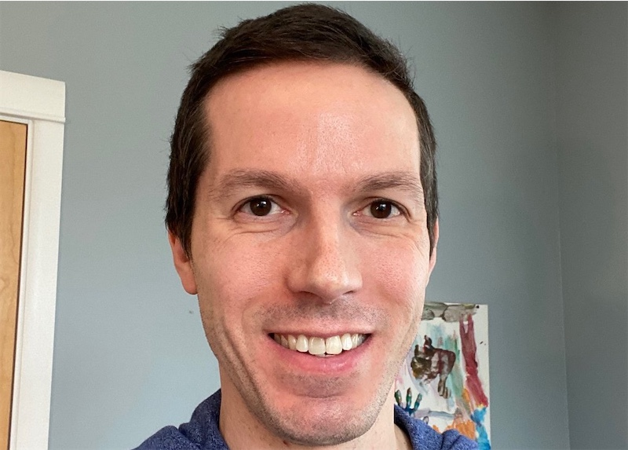
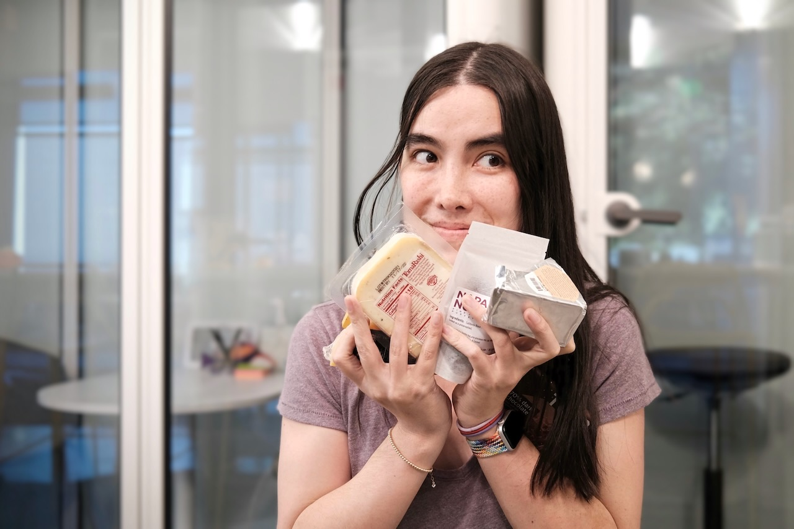

React development is led by a small dedicated team working full time at Meta. It also receives contributions from people all over the world.

## Meet the React Team {#meet-the-react-team}

The React team members work full time on the core component APIs, the engine that powers React DOM and React Native, React DevTools, and the React documentation website.

Current members of the React team are listed in alphabetical order below.

### Andrew Clark {#andrew-clark}

[@acdlite on GitHub](https://github.com/acdlite) &middot; [@acdlite on Twitter](https://twitter.com/acdlite)

Andrew got started with web development by making sites with WordPress, and eventually tricked himself into doing JavaScript. His favorite pastime is karaoke. Andrew is either a Disney villain or a Disney princess, depending on the day.

### Dan Abramov {#dan-abramov}

[@gaearon on GitHub](https://github.com/gaearon) &middot; [@dan_abramov on Twitter](https://twitter.com/dan_abramov)

Dan got into programming after he accidentally discovered Visual Basic inside Microsoft PowerPoint. He has found his true calling in turning [Sebastian](#sebastian-markbage)'s tweets into long-form blog posts. Dan occasionally wins at Fortnite by hiding in a bush until the game ends.

### Jason Bonta {#jason-bonta}

Jason likes having large volumes of Amazon packages delivered to the office so that he can build forts. Despite literally walling himself off from his team at times and not understanding how for-of loops work, we appreciate him for the unique qualities he brings to his work. 

### Joe Savona {#joe-savona}

[@josephsavona on GitHub](https://github.com/josephsavona) &middot; [@en_JS on Twitter](https://twitter.com/en_JS)

Joe was planning to major in math and philosophy but got into computer science after writing physics simulations in Matlab. Prior to React, he worked on Relay, RSocket.js, and the Skip programming language. While he’s not building some sort of reactive system he enjoys running, studying Japanese, and spending time with his family.

### Josh Story {#josh-story}

[@gnoff on GitHub](https://github.com/gnoff) &middot; [@joshcstory on Twitter](https://twitter.com/joshcstory)

Josh majored in Mathematics and discovered programming while in college. His first professional developer job was to program insurance rate calculations in Microsoft Excel, the paragon of Reactive Programming which must be why he now works on React. In between that time Josh has been an IC, Manager, and Executive at a few startups. outside of work he likes to push his limits with cooking.

### Lauren Tan {#lauren-tan}

[@poteto on GitHub](https://github.com/poteto) &middot; [@potetotes on Twitter](https://twitter.com/potetotes)

Lauren’s programming career peaked when she first discovered the `<marquee>` tag. She’s been chasing that high ever since. When she’s not adding bugs into React, she enjoys dropping cheeky memes in chat, and playing all too many video games with her partner, and her dog Zelda.

### Luna Ruan {#luna-ruan}

[@lunaruan on GitHub](https://github.com/lunaruan) &middot; [@lunaruan on Twitter](https://twitter.com/lunaruan)

Luna learned programming because she thought it meant creating video games. Instead, she ended up working on the Pinterest web app, and now on React itself. Luna doesn't want to make video games anymore, but she plans to do creative writing if she ever gets bored.

### Mofei Zhang {#mofei-zhang}

[@mofeiZ on GitHub](https://github.com/mofeiZ)]

Mofei started programming when she realized it can help her cheat in video games. She focused on operating systems in undergrad / grad school, but now finds herself happily tinkering on React. Outside of work, she enjoys debugging bouldering problems and planning her next backpacking trip(s).

### Rick Hanlon {#rick-hanlon}

[@rickhanlonii on GitHub](https://github.com/rickhanlonii) &middot; [@rickhanlonii on Twitter](https://twitter.com/rickhanlonii)

Ricky majored in theoretical math and somehow found himself on the React Native team for a couple years before joining the React team. When he's not programming you can find him snowboarding, biking, climbing, golfing, or closing GitHub issues that do not match the issue template.

### Samuel Susla {#samuel-susla}

[@sammy-SC on GitHub](https://github.com/sammy-SC) &middot; [@SamuelSusla on Twitter](https://twitter.com/SamuelSusla)

Samuel’s interest in programming started with the movie Matrix. He still has Matrix screen saver. Before working on React, he was focused on writing iOS apps. Outside of work, Samuel enjoys playing beach volleyball, squash, badminton and spending time with his family.

### Sathya Gunasekaran {#sathya-gunasekaran}

[@gsathya on GitHub](https://github.com/gsathya) &middot; [@_gsathya on Twitter](https://twitter.com/_gsathya)

Sathya hated the Dragon Book in school but somehow ended up working on compilers all his career. When he's not compiling React components, he's either drinking coffee or eating yet another Dosa.

### Sebastian Markbåge {#sebastian-markbage}

[@sebmarkbage on GitHub](https://github.com/sebmarkbage) &middot; [@sebmarkbage on Twitter](https://twitter.com/sebmarkbage)

Sebastian majored in psychology. He's usually quiet. Even when he says something, it often doesn't make sense to the rest of us until a few months later. The correct way to pronounce his surname is "mark-boa-geh" but he settled for "mark-beige" out of pragmatism -- and that's how he approaches React.

### Sebastian Silbermann {#sebastian-silbermann}

[@eps1lon on GitHub](https://github.com/eps1lon) &middot; [@sebsilbermann on Twitter](https://twitter.com/sebsilbermann)

Sebastian learned programming to make the browser games he played during class more enjoyable. Eventually this lead to contributing to as much open source code as possible. Outside of coding he's busy making sure people don't confuse him with the other Sebastians and Zilberman of the React community.

### Seth Webster {#seth-webster}

[@sethwebster on GitHub](https://github.com/sethwebster) &middot; [@sethwebster on Twitter](https://twitter.com/sethwebster)

Seth started programming as a kid growing up in Tucson, AZ. After school, he was bitten by the music bug and was a touring musician for about 10 years before returning to *work*, starting with Intuit. In his spare time, he loves [taking pictures](https://www.sethwebster.com) and flying for animal rescues in the northeastern United States.

### Sophie Alpert {#sophie-alpert}

[@sophiebits on GitHub](https://github.com/sophiebits) &middot; [@sophiebits on Twitter](https://twitter.com/sophiebits)

Four days after React was released, Sophie rewrote the entirety of her then-current project to use it, which she now realizes was perhaps a bit reckless. After she became the project's #1 committer, she wondered why she wasn't getting paid by Facebook like everyone else was and joined the team officially to lead React through its adolescent years. Though she quit that job years ago, somehow she's still in the team's group chats and “providing value”.

### Tianyu Yao {#tianyu-yao}

[@tyao1 on GitHub](https://github.com/tyao1) &middot; [@tianyu0 on Twitter](https://twitter.com/tianyu0)

Tianyu’s interest in computers started as a kid because he loves video games. So he majored in computer science and still plays childish games like League of Legends. When he is not in front of a computer, he enjoys playing with his two kittens, hiking and kayaking.

### Yuzhi Zheng {#yuzhi-zheng}

[@yuzhi on GitHub](https://github.com/yuzhi) &middot; [@yuzhiz on Twitter](https://twitter.com/yuzhiz)

Yuzhi studied Computer Science in school. She liked the instant gratification of seeing code come to life without having to physically be in a laboratory. Now she’s a manager in the React org. Before management, she used to work on the Relay data fetching framework. In her spare time, Yuzhi enjoys optimizing her life via gardening and home improvement projects.

## Acknowledgements {#acknowledgements}

React was originally created by [Jordan Walke](https://github.com/jordwalke). Today, React has over a thousand open source contributors. We'd like to recognize a few people who have made significant contributions to React and its documentation in the past and have helped maintain them over the years:

* [Almero Steyn](https://github.com/AlmeroSteyn)
* [Andreas Svensson](https://github.com/syranide)
* [Alex Krolick](https://github.com/alexkrolick)
* [Alexey Pyltsyn](https://github.com/lex111)
* [Brandon Dail](https://github.com/aweary)
* [Brian Vaughn](https://github.com/bvaughn)
* [Caleb Meredith](https://github.com/calebmer)
* [Chang Yan](https://github.com/cyan33)
* [Cheng Lou](https://github.com/chenglou)
* [Christoph Nakazawa](https://github.com/cpojer)
* [Christopher Chedeau](https://github.com/vjeux)
* [Clement Hoang](https://github.com/clemmy)
* [Dominic Gannaway](https://github.com/trueadm)
* [Flarnie Marchan](https://github.com/flarnie)
* [Jason Quense](https://github.com/jquense)
* [Jesse Beach](https://github.com/jessebeach)
* [Jessica Franco](https://github.com/Jessidhia)
* [Jim Sproch](https://github.com/jimfb)
* [Josh Duck](https://github.com/joshduck)
* [Joe Critchley](https://github.com/joecritch)
* [Jeff Morrison](https://github.com/jeffmo)
* [Keyan Zhang](https://github.com/keyz)
* [Marco Salazar](https://github.com/salazarm)
* [Nat Alison](https://github.com/tesseralis)
* [Nathan Hunzaker](https://github.com/nhunzaker)
* [Nicolas Gallagher](https://github.com/necolas)
* [Paul O'Shannessy](https://github.com/zpao)
* [Pete Hunt](https://github.com/petehunt)
* [Philipp Spiess](https://github.com/philipp-spiess)
* [Rachel Nabors](https://github.com/rachelnabors)
* [Robert Zhang](https://github.com/robertzhidealx)
* [Sander Spies](https://github.com/sanderspies)
* [Sasha Aickin](https://github.com/aickin)
* [Sophia Shoemaker](https://github.com/mrscobbler)
* [Sunil Pai](https://github.com/threepointone)
* [Tim Yung](https://github.com/yungsters)
* [Xuan Huang](https://github.com/huxpro)

This list is not exhaustive.

We'd like to give special thanks to [Tom Occhino](https://github.com/tomocchino) and [Adam Wolff](https://github.com/wolffiex) for their guidance and support over the years. We'd also like to thank all the volunteers who [translated React into other languages](https://translations.reactjs.org/).
