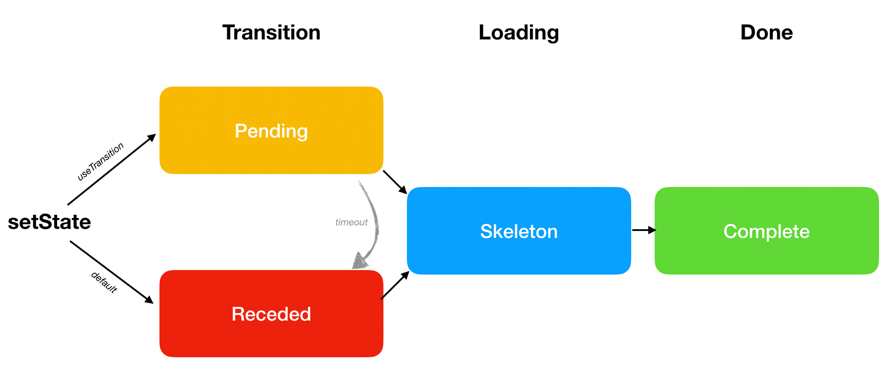

<style>
.scary > blockquote {
  background-color: rgba(237, 51, 21, 0.2);
  border-left-color: #ed3315;
}
</style>

<div class="scary">

>Caution:
>
>This page describes **experimental features that are [not yet available](/docs/concurrent-mode-adoption.html) in a stable release**. Don't rely on experimental builds of React in production apps. These features may change significantly and without a warning before they become a part of React.
>
>This documentation is aimed at early adopters and people who are curious. **If you're new to React, don't worry about these features** -- you don't need to learn them right now. For example, if you're looking for a data fetching tutorial that works today, read [this article](https://www.robinwieruch.de/react-hooks-fetch-data/) instead.

</div>

Usually, when we update the state, we expect to see changes on the screen immediately. This makes sense because we want to keep our app responsive to user input. However, there are cases where we might prefer to **defer an update from appearing on the screen**.

For example, if we switch from one page to another, and none of the code or data for the next screen has loaded yet, it might be frustrating to immediately see a blank page with a loading indicator. We might prefer to stay longer on the previous screen. Implementing this pattern has historically been difficult in React. Concurrent Mode offers a new set of tools to do that.

- [Transitions](#transitions)
  - [Wrapping setState in a Transition](#wrapping-setstate-in-a-transition)
  - [Adding a Pending Indicator](#adding-a-pending-indicator)
  - [Reviewing the Changes](#reviewing-the-changes)
  - [Where Does the Update Happen?](#where-does-the-update-happen)
  - [Transitions Are Everywhere](#transitions-are-everywhere)
  - [Baking Transitions Into the Design System](#baking-transitions-into-the-design-system)
- [The Three Steps](#the-three-steps)
  - [Default: Receded → Skeleton → Complete](#default-receded-skeleton-complete)
  - [Preferred: Pending → Skeleton → Complete](#preferred-pending-skeleton-complete)
  - [Wrap Lazy Features in `<Suspense>`](#wrap-lazy-features-in-suspense)
  - [Suspense Reveal “Train”](#suspense-reveal-train)
  - [Delaying a Pending Indicator](#delaying-a-pending-indicator)
  - [Recap](#recap)
- [Other Patterns](#other-patterns)
  - [Splitting High and Low Priority State](#splitting-high-and-low-priority-state)
  - [Deferring a Value](#deferring-a-value)
  - [SuspenseList](#suspenselist)
- [Next Steps](#next-steps)

## Transitions {#transitions}

Let's revisit [this demo](https://codesandbox.io/s/infallible-feather-xjtbu) from the previous page about [Suspense for Data Fetching](/docs/concurrent-mode-suspense.html).

When we click the "Next" button to switch the active profile, the existing page data immediately disappears, and we see the loading indicator for the whole page again. We can call this an "undesirable" loading state. **It would be nice if we could "skip" it and wait for some content to load before transitioning to the new screen.**

React offers a new built-in `useTransition()` Hook to help with this.

We can use it in three steps.

First, we'll make sure that we're actually using Concurrent Mode. We'll talk more about [adopting Concurrent Mode](/docs/concurrent-mode-adoption.html) later, but for now it's sufficient to know that we need to use `ReactDOM.createRoot()` rather than `ReactDOM.render()` for this feature to work:

```js
const rootElement = document.getElementById("root");
// Opt into Concurrent Mode
ReactDOM.createRoot(rootElement).render(<App />);
```

Next, we'll add an import for the `useTransition` Hook from React:

```js
import React, { useState, useTransition, Suspense } from "react";
```

Finally, we'll use it inside the `App` component:

```js{3-5}
function App() {
  const [resource, setResource] = useState(initialResource);
  const [startTransition, isPending] = useTransition({
    timeoutMs: 3000
  });
  // ...
```

**By itself, this code doesn't do anything yet.** We will need to use this Hook's return values to set up our state transition. There are two values returned from `useTransition`:

* `startTransition` is a function. We'll use it to tell React *which* state update we want to defer.
* `isPending` is a boolean. It's React telling us whether that transition is ongoing at the moment.

We will use them right below.

Note we passed a configuration object to `useTransition`. Its `timeoutMs` property specifies **how long we're willing to wait for the transition to finish**. By passing `{timeoutMs: 3000}`, we say "If the next profile takes more than 3 seconds to load, show the big spinner -- but before that timeout it's okay to keep showing the previous screen".

### Wrapping setState in a Transition {#wrapping-setstate-in-a-transition}

Our "Next" button click handler sets the state that switches the current profile in the state:

```js{4}
<button
  onClick={() => {
    const nextUserId = getNextId(resource.userId);
    setResource(fetchProfileData(nextUserId));
  }}
>
```

 We'll wrap that state update into `startTransition`. That's how we tell React **we don't mind React delaying that state update** if it leads to an undesirable loading state:

```js{3,6}
<button
  onClick={() => {
    startTransition(() => {
      const nextUserId = getNextId(resource.userId);
      setResource(fetchProfileData(nextUserId));
    });
  }}
>
```

**[Try it on CodeSandbox](https://codesandbox.io/s/musing-driscoll-6nkie)**

Press "Next" a few times. Notice it already feels very different. **Instead of immediately seeing an empty screen on click, we now keep seeing the previous page for a while.** When the data has loaded, React transitions us to the new screen.

If we make our API responses take 5 seconds, [we can confirm](https://codesandbox.io/s/relaxed-greider-suewh) that now React "gives up" and transitions anyway to the next screen after 3 seconds. This is because we passed `{timeoutMs: 3000}` to `useTransition()`. For example, if we passed `{timeoutMs: 60000}` instead, it would wait a whole minute.

### Adding a Pending Indicator {#adding-a-pending-indicator}

There's still something that feels broken about [our last example](https://codesandbox.io/s/musing-driscoll-6nkie). Sure, it's nice not to see a "bad" loading state. **But having no indication of progress at all feels even worse!** When we click "Next", nothing happens and it feels like the app is broken.

Our `useTransition()` call returns two values: `startTransition` and `isPending`.

```js
  const [startTransition, isPending] = useTransition({ timeoutMs: 3000 });
```

We've already used `startTransition` to wrap the state update. Now we're going to use `isPending` too. React gives this boolean to us so we can tell whether **we're currently waiting for this transition to finish**. We'll use it to indicate that something is happening:

```js{4,14}
return (
  <>
    <button
      disabled={isPending}
      onClick={() => {
        startTransition(() => {
          const nextUserId = getNextId(resource.userId);
          setResource(fetchProfileData(nextUserId));
        });
      }}
    >
      Next
    </button>
    {isPending ? " Loading..." : null}
    <ProfilePage resource={resource} />
  </>
);
```

**[Try it on CodeSandbox](https://codesandbox.io/s/jovial-lalande-26yep)**

Now, this feels a lot better! When we click Next, it gets disabled because clicking it multiple times doesn't make sense. And the new "Loading..." tells the user that the app didn't freeze.

### Reviewing the Changes {#reviewing-the-changes}

Let's take another look at all the changes we've made since the [original example](https://codesandbox.io/s/infallible-feather-xjtbu):

```js{3-5,9,11,14,19}
function App() {
  const [resource, setResource] = useState(initialResource);
  const [startTransition, isPending] = useTransition({
    timeoutMs: 3000
  });
  return (
    <>
      <button
        disabled={isPending}
        onClick={() => {
          startTransition(() => {
            const nextUserId = getNextId(resource.userId);
            setResource(fetchProfileData(nextUserId));
          });
        }}
      >
        Next
      </button>
      {isPending ? " Loading..." : null}
      <ProfilePage resource={resource} />
    </>
  );
}
```

**[Try it on CodeSandbox](https://codesandbox.io/s/jovial-lalande-26yep)**

It took us only seven lines of code to add this transition:

* We've imported the `useTransition` Hook and used it the component that updates the state.
* We've passed `{timeoutMs: 3000}` to stay on the previous screen for at most 3 seconds.
* We've wrapped our state update into `startTransition` to tell React it's okay to delay it.
* We're using `isPending` to communicate the state transition progress to the user and to disable the button.

As a result, clicking "Next" doesn't perform an immediate state transition to an "undesirable" loading state, but instead stays on the previous screen and communicates progress there.

### Where Does the Update Happen? {#where-does-the-update-happen}

This wasn't very difficult to implement. However, if you start thinking about how this could possibly work, it might become a little mindbending. If we set the state, how come we don't see the result right away? *Where* is the next `<ProfilePage>` rendering?

Clearly, both "versions" of `<ProfilePage>` exist at the same time. We know the old one exists because we see it on the screen and even display a progress indicator on it. And we know the new version also exists *somewhere*, because it's the one that we're waiting for!

**But how can two versions of the same component exist at the same time?**

This gets at the root of what Concurrent Mode is. We've [previously said](/docs/concurrent-mode-intro.html#intentional-loading-sequences) it's a bit like React working on state update on a "branch". Another way we can conceptualize is that wrapping a state update in `startTransition` begins rendering it *"in a different universe"*, much like in science fiction movies. We don't "see" that universe directly -- but we can get a signal from it that tells us something is happening (`isPending`). When the update is ready, our "universes" merge back together, and we see the result on the screen!

Play a bit more with the [demo](https://codesandbox.io/s/jovial-lalande-26yep), and try to imagine it happening.

Of course, two versions of the tree rendering *at the same time* is an illusion, just like the idea that all programs run on your computer at the same time is an illusion. An operating system switches between different applications very fast. Similarly, React can switch between the version of the tree you see on the screen and the version that it's "preparing" to show next.

An API like `useTransition` lets you focus on the desired user experience, and not think about the mechanics of how it's implemented. Still, it can be a helpful metaphor to imagine that updates wrapped in `startTransition` happen "on a branch" or "in a different world".

### Transitions Are Everywhere {#transitions-are-everywhere}

As we learned from the [Suspense walkthrough](/docs/concurrent-mode-suspense.html), any component can "suspend" any time if some data it needs is not ready yet. We can strategically place `<Suspense>` boundaries in different parts of the tree to handle this, but it won't always be enough.

Let's get back to our [first Suspense demo](https://codesandbox.io/s/frosty-hermann-bztrp) where there was just one profile. Currently, it fetches the data only once. We'll add a "Refresh" button to check for server updates.

Our first attempt might look like this:

```js{6-8,13-15}
const initialResource = fetchUserAndPosts();

function ProfilePage() {
  const [resource, setResource] = useState(initialResource);

  function handleRefreshClick() {
    setResource(fetchUserAndPosts());
  }

  return (
    <Suspense fallback={<h1>Loading profile...</h1>}>
      <ProfileDetails resource={resource} />
      <button onClick={handleRefreshClick}>
        Refresh
      </button>
      <Suspense fallback={<h1>Loading posts...</h1>}>
        <ProfileTimeline resource={resource} />
      </Suspense>
    </Suspense>
  );
}
```

**[Try it on CodeSandbox](https://codesandbox.io/s/boring-shadow-100tf)**

In this example, we start data fetching at the load *and* every time you press "Refresh". We put the result of calling `fetchUserAndPosts()` into state so that components below can start reading the new data from the request we just kicked off.

We can see in [this example](https://codesandbox.io/s/boring-shadow-100tf) that pressing "Refresh" works. The `<ProfileDetails>` and `<ProfileTimeline>` components receive a new `resource` prop that represents the fresh data, they "suspend" because we don't have a response yet, and we see the fallbacks. When the response loads, we can see the updated posts (our fake API adds them every 3 seconds).

However, the experience feels really jarring. We were browsing a page, but it got replaced by a loading state right as we were interacting with it. It's disorienting. **Just like before, to avoid showing an undesirable loading state, we can wrap the state update in a transition:**

```js{2-5,9-11,21}
function ProfilePage() {
  const [startTransition, isPending] = useTransition({
    // Wait 10 seconds before fallback
    timeoutMs: 10000
  });
  const [resource, setResource] = useState(initialResource);

  function handleRefreshClick() {
    startTransition(() => {
      setResource(fetchProfileData());
    });
  }

  return (
    <Suspense fallback={<h1>Loading profile...</h1>}>
      <ProfileDetails resource={resource} />
      <button
        onClick={handleRefreshClick}
        disabled={isPending}
      >
        {isPending ? "Refreshing..." : "Refresh"}
      </button>
      <Suspense fallback={<h1>Loading posts...</h1>}>
        <ProfileTimeline resource={resource} />
      </Suspense>
    </Suspense>
  );
}
```

**[Try it on CodeSandbox](https://codesandbox.io/s/sleepy-field-mohzb)**

This feels a lot better! Clicking "Refresh" doesn't pull us away from the page we're browsing anymore. We see something is loading "inline", and when the data is ready, it's displayed.

### Baking Transitions Into the Design System {#baking-transitions-into-the-design-system}

We can now see that the need for `useTransition` is *very* common. Pretty much any button click or interaction that can lead to a component suspending needs to be wrapped in `useTransition` to avoid accidentally hiding something the user is interacting with.

This can lead to a lot of repetitive code across components. This is why **we generally recommend to bake `useTransition` into the *design system* components of your app**. For example, we can extract the transition logic into our own `<Button>` component:

```js{7-9,20,24}
function Button({ children, onClick }) {
  const [startTransition, isPending] = useTransition({
    timeoutMs: 10000
  });

  function handleClick() {
    startTransition(() => {
      onClick();
    });
  }

  const spinner = (
    // ...
  );

  return (
    <>
      <button
        onClick={handleClick}
        disabled={isPending}
      >
        {children}
      </button>
      {isPending ? spinner : null}
    </>
  );
}
```

**[Try it on CodeSandbox](https://codesandbox.io/s/modest-ritchie-iufrh)**

Note that the button doesn't care *what* state we're updating. It's wrapping *any* state updates that happen during its `onClick` handler into a transition. Now that our `<Button>` takes care of setting up the transition, the `<ProfilePage>` component doesn't need to set up its own:

```js{4-6,11-13}
function ProfilePage() {
  const [resource, setResource] = useState(initialResource);

  function handleRefreshClick() {
    setResource(fetchProfileData());
  }

  return (
    <Suspense fallback={<h1>Loading profile...</h1>}>
      <ProfileDetails resource={resource} />
      <Button onClick={handleRefreshClick}>
        Refresh
      </Button>
      <Suspense fallback={<h1>Loading posts...</h1>}>
        <ProfileTimeline resource={resource} />
      </Suspense>
    </Suspense>
  );
}
```

**[Try it on CodeSandbox](https://codesandbox.io/s/modest-ritchie-iufrh)**

When a button gets clicked, it starts a transition and calls `props.onClick()` inside of it -- which triggers `handleRefreshClick` in the `<ProfilePage>` component. We start fetching the fresh data, but it doesn't trigger a fallback because we're inside a transition, and the 10 second timeout specified in the `useTransition` call hasn't passed yet. While a transition is pending, the button displays an inline loading indicator.

We can see now how Concurrent Mode helps us achieve a good user experience without sacrificing isolation and modularity of components. React coordinates the transition.

## The Three Steps {#the-three-steps}

By now we have discussed all of the different visual states that an update may go through. In this section, we will give them names and talk about the progression between them.

<br>



At the very end, we have the **Complete** state. That's where we want to eventually get to. It represents the moment when the next screen is fully rendered and isn't loading more data.

But before our screen can be Complete, we might need to load some data or code. When we're on the next screen, but some parts of it are still loading, we call that a **Skeleton** state.

Finally, there are two primary ways that lead us to the Skeleton state. We will illustrate the difference between them with a concrete example.

### Default: Receded → Skeleton → Complete {#default-receded-skeleton-complete}

Open [this example](https://codesandbox.io/s/prod-grass-g1lh5) and click "Open Profile". You will see several visual states one by one:

* **Receded**: For a second, you will see the `<h1>Loading the app...</h1>` fallback.
* **Skeleton:** You will see the `<ProfilePage>` component with `<h2>Loading posts...</h2>` inside.
* **Complete:** You will see the `<ProfilePage>` component with no fallbacks inside. Everything was fetched.

How do we separate the Receded and the Skeleton states? The difference between them is that the **Receded** state feels like "taking a step back" to the user, while the **Skeleton** state feels like "taking a step forward" in our progress to show more content.

In this example, we started our journey on the `<HomePage>`:

```js
<Suspense fallback={...}>
  {/* previous screen */}
  <HomePage />
</Suspense>
```

After the click, React started rendering the next screen:

```js
<Suspense fallback={...}>
  {/* next screen */}
  <ProfilePage>
    <ProfileDetails />
    <Suspense fallback={...}>
      <ProfileTimeline />
    </Suspense>
  </ProfilePage>
</Suspense>
```

Both `<ProfileDetails>` and `<ProfileTimeline>` need data to render, so they suspend:

```js{4,6}
<Suspense fallback={...}>
  {/* next screen */}
  <ProfilePage>
    <ProfileDetails /> {/* suspends! */}
    <Suspense fallback={<h2>Loading posts...</h2>}>
      <ProfileTimeline /> {/* suspends! */}
    </Suspense>
  </ProfilePage>
</Suspense>
```

When a component suspends, React needs to show the closest fallback. But the closest fallback to `<ProfileDetails>` is at the top level:

```js{2,3,7}
<Suspense fallback={
  // We see this fallback now because of <ProfileDetails>
  <h1>Loading the app...</h1>
}>
  {/* next screen */}
  <ProfilePage>
    <ProfileDetails /> {/* suspends! */}
    <Suspense fallback={...}>
      <ProfileTimeline />
    </Suspense>
  </ProfilePage>
</Suspense>
```

This is why when we click the button, it feels like we've "taken a step back". The `<Suspense>` boundary which was previously showing useful content (`<HomePage />`) had to "recede" to showing the fallback (`<h1>Loading the app...</h1>`). We call that a **Receded** state.

As we load more data, React will retry rendering, and `<ProfileDetails>` can render successfully. Finally, we're in the **Skeleton** state. We see the new page with missing parts:

```js{6,7,9}
<Suspense fallback={...}>
  {/* next screen */}
  <ProfilePage>
    <ProfileDetails />
    <Suspense fallback={
      // We see this fallback now because of <ProfileTimeline>
      <h2>Loading posts...</h2>
    }>
      <ProfileTimeline /> {/* suspends! */}
    </Suspense>
  </ProfilePage>
</Suspense>
```

Eventually, they load too, and we get to the **Complete** state.

This scenario (Receded → Skeleton → Complete) is the default one. However, the Receded state is not very pleasant because it "hides" existing information. This is why React lets us opt into a different sequence (**Pending** → Skeleton → Complete) with `useTransition`.

### Preferred: Pending → Skeleton → Complete {#preferred-pending-skeleton-complete}

When we `useTransition`, React will let us "stay" on the previous screen -- and show a progress indicator there. We call that a **Pending** state. It feels much better than the Receded state because none of our existing content disappears, and the page stays interactive.

You can compare these two examples to feel the difference:

* Default: [Receded → Skeleton → Complete](https://codesandbox.io/s/prod-grass-g1lh5)
* **Preferred: [Pending → Skeleton → Complete](https://codesandbox.io/s/focused-snow-xbkvl)**

The only difference between these two examples is that the first uses regular `<button>`s, but the second one uses our custom `<Button>` component with `useTransition`.

### Wrap Lazy Features in `<Suspense>` {#wrap-lazy-features-in-suspense}

Open [this example](https://codesandbox.io/s/nameless-butterfly-fkw5q). When you press a button, you'll see the Pending state for a second before moving on. This transition feels nice and fluid.

We will now add a brand new feature to the profile page -- a list of fun facts about a person:

```js{8,13-25}
function ProfilePage({ resource }) {
  return (
    <>
      <ProfileDetails resource={resource} />
      <Suspense fallback={<h2>Loading posts...</h2>}>
        <ProfileTimeline resource={resource} />
      </Suspense>
      <ProfileTrivia resource={resource} />
    </>
  );
}

function ProfileTrivia({ resource }) {
  const trivia = resource.trivia.read();
  return (
    <>
      <h2>Fun Facts</h2>
      <ul>
        {trivia.map(fact => (
          <li key={fact.id}>{fact.text}</li>
        ))}
      </ul>
    </>
  );
}
```

**[Try it on CodeSandbox](https://codesandbox.io/s/focused-mountain-uhkzg)**

If you press "Open Profile" now, you can tell something is wrong. It takes a whole seven seconds to make the transition now! This is because our trivia API is too slow. Let's say we can't make the API faster. How can we improve the user experience with this constraint?

If we don't want to stay in the Pending state for too long, our first instinct might be to set `timeoutMs` in `useTransition` to something smaller, like `3000`. You can try this [here](https://codesandbox.io/s/practical-kowalevski-kpjg4). This lets us escape the prolonged Pending state, but we still don't have anything useful to show!

There is a simpler way to solve this. **Instead of making the transition shorter, we can "disconnect" the slow component from the transition** by wrapping it into `<Suspense>`:

```js{8,10}
function ProfilePage({ resource }) {
  return (
    <>
      <ProfileDetails resource={resource} />
      <Suspense fallback={<h2>Loading posts...</h2>}>
        <ProfileTimeline resource={resource} />
      </Suspense>
      <Suspense fallback={<h2>Loading fun facts...</h2>}>
        <ProfileTrivia resource={resource} />
      </Suspense>
    </>
  );
}
```

**[Try it on CodeSandbox](https://codesandbox.io/s/condescending-shape-s6694)**

This reveals an important insight. React always prefers to go to the Skeleton state as soon as possible. Even if we use transitions with long timeouts everywhere, React will not stay in the Pending state for longer than necessary to avoid the Receded state.

**If some feature isn't a vital part of the next screen, wrap it in `<Suspense>` and let it load lazily.** This ensures we can show the rest of the content as soon as possible. Conversely, if a screen is *not worth showing* without some component, such as `<ProfileDetails>` in our example, do *not* wrap it in `<Suspense>`. Then the transitions will "wait" for it to be ready.

### Suspense Reveal "Train" {#suspense-reveal-train}

When we're already on the next screen, sometimes the data needed to "unlock" different `<Suspense>` boundaries arrives in quick succession. For example, two different responses might arrive after 1000ms and 1050ms, respectively. If you've already waited for a second, waiting another 50ms is not going to be perceptible. This is why React reveals `<Suspense>` boundaries on a schedule, like a "train" that arrives periodically. This trades a small delay for reducing the layout thrashing and the number of visual changes presented to the user.

You can see a demo of this [here](https://codesandbox.io/s/admiring-mendeleev-y54mk). The "posts" and "fun facts" responses come within 100ms of each other. But React coalesces them and "reveals" their Suspense boundaries together. 

### Delaying a Pending Indicator {#delaying-a-pending-indicator}

Our `Button` component will immediately show the Pending state indicator on click:

```js{2,13}
function Button({ children, onClick }) {
  const [startTransition, isPending] = useTransition({
    timeoutMs: 10000
  });

  // ...

  return (
    <>
      <button onClick={handleClick} disabled={isPending}>
        {children}
      </button>
      {isPending ? spinner : null}
    </>
  );
}
```

**[Try it on CodeSandbox](https://codesandbox.io/s/floral-thunder-iy826)**

This signals to the user that some work is happening. However, if the transition is relatively short (less than 500ms), it might be too distracting and make the transition itself feel *slower*.

One possible solution to this is to *delay the spinner itself* from displaying:

```css
.DelayedSpinner {
  animation: 0s linear 0.5s forwards makeVisible;
  visibility: hidden;
}

@keyframes makeVisible {
  to {
    visibility: visible;
  }
}
```

```js{2-4,10}
const spinner = (
  <span className="DelayedSpinner">
    {/* ... */}
  </span>
);

return (
  <>
    <button onClick={handleClick}>{children}</button>
    {isPending ? spinner : null}
  </>
);
```

**[Try it on CodeSandbox](https://codesandbox.io/s/gallant-spence-l6wbk)**

With this change, even though we're in the Pending state, we don't display any indication to the user until 500ms has passed. This may not seem like much of an improvement when the API responses are slow. But compare how it feels [before](https://codesandbox.io/s/thirsty-liskov-1ygph) and [after](https://codesandbox.io/s/hardcore-http-s18xr) when the API call is fast. Even though the rest of the code hasn't changed, suppressing a "too fast" loading state improves the perceived performance by not calling attention to the delay.

### Recap {#recap}

The most important things we learned so far are:

* By default, our loading sequence is Receded → Skeleton → Complete.
* The Receded state doesn't feel very nice because it hides existing content.
* With `useTransition`, we can opt into showing a Pending state first instead. This will keep us on the previous screen while the next screen is being prepared.
* If we don't want some component to delay the transition, we can wrap it in its own `<Suspense>` boundary.
* Instead of doing `useTransition` in every other component, we can build it into our design system.

## Other Patterns {#other-patterns}

Transitions are probably the most common Concurrent Mode pattern you'll encounter, but there are a few more patterns you might find useful.

### Splitting High and Low Priority State {#splitting-high-and-low-priority-state}

When you design React components, it is usually best to find the "minimal representation" of state. For example, instead of keeping `firstName`, `lastName`, and `fullName` in state, it's usually better keep only `firstName` and `lastName`, and then calculate `fullName` during rendering. This lets us avoid mistakes where we update one state but forget the other state.

However, in Concurrent Mode there are cases where you might *want* to "duplicate" some data in different state variables. Consider this tiny translation app:

```js
const initialQuery = "Hello, world";
const initialResource = fetchTranslation(initialQuery);

function App() {
  const [query, setQuery] = useState(initialQuery);
  const [resource, setResource] = useState(initialResource);

  function handleChange(e) {
    const value = e.target.value;
    setQuery(value);
    setResource(fetchTranslation(value));
  }

  return (
    <>
      <input
        value={query}
        onChange={handleChange}
      />
      <Suspense fallback={<p>Loading...</p>}>
        <Translation resource={resource} />
      </Suspense>
    </>
  );
}

function Translation({ resource }) {
  return (
    <p>
      <b>{resource.read()}</b>
    </p>
  );
}
```

**[Try it on CodeSandbox](https://codesandbox.io/s/brave-villani-ypxvf)**

Notice how when you type into the input, the `<Translation>` component suspends, and we see the `<p>Loading...</p>` fallback until we get fresh results. This is not ideal. It would be better if we could see the *previous* translation for a bit while we're fetching the next one.

In fact, if we open the console, we'll see a warning:

```
Warning: App triggered a user-blocking update that suspended.

The fix is to split the update into multiple parts: a user-blocking update to provide immediate feedback, and another update that triggers the bulk of the changes.

Refer to the documentation for useTransition to learn how to implement this pattern.
```

As we mentioned earlier, if some state update causes a component to suspend, that state update should be wrapped in a transition. Let's add `useTransition` to our component:

```js{4-6,10,13}
function App() {
  const [query, setQuery] = useState(initialQuery);
  const [resource, setResource] = useState(initialResource);
  const [startTransition, isPending] = useTransition({
    timeoutMs: 5000
  });

  function handleChange(e) {
    const value = e.target.value;
    startTransition(() => {
      setQuery(value);
      setResource(fetchTranslation(value));
    });
  }

  // ...

}
```

**[Try it on CodeSandbox](https://codesandbox.io/s/zen-keldysh-rifos)**

Try typing into the input now. Something's wrong! The input is updating very slowly.

We've fixed the first problem (suspending outside of a transition). But now because of the transition, our state doesn't update immediately, and it can't "drive" a controlled input!

The answer to this problem **is to split the state in two parts:** a "high priority" part that updates immediately, and a "low priority" part that may wait for a transition.

In our example, we already have two state variables. The input text is in `query`, and we read the translation from `resource`. We want changes to the `query` state to happen immediately, but changes to the `resource` (i.e. fetching a new translation) should trigger a transition.

So the correct fix is to put `setQuery` (which doesn't suspend) *outside* the transition, but `setResource` (which will suspend) *inside* of it.

```js{4,5}
function handleChange(e) {
  const value = e.target.value;
  
  // Outside the transition (urgent)
  setQuery(value);

  startTransition(() => {
    // Inside the transition (may be delayed)
    setResource(fetchTranslation(value));
  });
}
```

**[Try it on CodeSandbox](https://codesandbox.io/s/lively-smoke-fdf93)**

With this change, it works as expected. We can type into the input immediately, and the translation later "catches up" to what we have typed.

### Deferring a Value {#deferring-a-value}

By default, React always renders a consistent UI. Consider code like this:

```js
<>
  <ProfileDetails user={user} />
  <ProfileTimeline user={user} />
</>
```

React guarantees that whenever we look at these components on the screen, they will reflect data from the same `user`. If a different `user` is passed down because of a state update, you would see them changing together. You can't ever record a screen and find a frame where they would show values from different `user`s. (If you ever run into a case like this, file a bug!)

This makes sense in the vast majority of situations. Inconsistent UI is confusing and can mislead users. (For example, it would be terrible if a messenger's Send button and the conversation picker pane "disagreed" about which thread is currently selected.)

However, sometimes it might be helpful to intentionally introduce an inconsistency. We could do it manually by "splitting" the state like above, but React also offers a built-in Hook for this:

```js
import { useDeferredValue } from 'react';

const deferredValue = useDeferredValue(value, {
  timeoutMs: 5000
});
```

To demonstrate this feature, we'll use [the profile switcher example](https://codesandbox.io/s/musing-ramanujan-bgw2o). Click the "Next" button and notice how it takes 1 second to do a transition.

Let's say that fetching the user details is very fast and only takes 300 milliseconds. Currently, we're waiting a whole second because we need both user details and posts to display a consistent profile page. But what if we want to show the details faster?

If we're willing to sacrifice consistency, we could **pass potentially stale data to the components that delay our transition**. That's what `useDeferredValue()` lets us do:

```js{2-4,10,11,21}
function ProfilePage({ resource }) {
  const deferredResource = useDeferredValue(resource, {
    timeoutMs: 1000
  });
  return (
    <Suspense fallback={<h1>Loading profile...</h1>}>
      <ProfileDetails resource={resource} />
      <Suspense fallback={<h1>Loading posts...</h1>}>
        <ProfileTimeline
          resource={deferredResource}
          isStale={deferredResource !== resource}
        />
      </Suspense>
    </Suspense>
  );
}

function ProfileTimeline({ isStale, resource }) {
  const posts = resource.posts.read();
  return (
    <ul style={{ opacity: isStale ? 0.7 : 1 }}>
      {posts.map(post => (
        <li key={post.id}>{post.text}</li>
      ))}
    </ul>
  );
}
```

**[Try it on CodeSandbox](https://codesandbox.io/s/vigorous-keller-3ed2b)**

The tradeoff we're making here is that `<ProfileTimeline>` will be inconsistent with other components and potentially show an older item. Click "Next" a few times, and you'll notice it. But thanks to that, we were able to cut down the transition time from 1000ms to 300ms.

Whether or not it's an appropriate tradeoff depends on the situation. But it's a handy tool, especially when the content doesn't change noticeably between items, and the user might not even realize they were looking at a stale version for a second.

It's worth noting that `useDeferredValue` is not *only* useful for data fetching. It also helps when an expensive component tree causes an interaction (e.g. typing in an input) to be sluggish. Just like we can "defer" a value that takes too long to fetch (and show its old value despite other components updating), we can do this with trees that take too long to render.

For example, consider a filterable list like this:

```js
function App() {
  const [text, setText] = useState("hello");

  function handleChange(e) {
    setText(e.target.value);
  }

  return (
    <div className="App">
      <label>
        Type into the input:{" "}
        <input value={text} onChange={handleChange} />
      </label>
      ...
      <MySlowList text={text} />
    </div>
  );
}
```

**[Try it on CodeSandbox](https://codesandbox.io/s/pensive-shirley-wkp46)**

In this example, **every item in `<MySlowList>` has an artificial slowdown -- each of them blocks the thread for a few milliseconds**. We'd never do this in a real app, but this helps us simulate what can happen in a deep component tree with no single obvious place to optimize.

We can see how typing in the input causes stutter. Now let's add `useDeferredValue`:

```js{3-5,18}
function App() {
  const [text, setText] = useState("hello");
  const deferredText = useDeferredValue(text, {
    timeoutMs: 5000
  });

  function handleChange(e) {
    setText(e.target.value);
  }

  return (
    <div className="App">
      <label>
        Type into the input:{" "}
        <input value={text} onChange={handleChange} />
      </label>
      ...
      <MySlowList text={deferredText} />
    </div>
  );
}
```

**[Try it on CodeSandbox](https://codesandbox.io/s/infallible-dewdney-9fkv9)**

Now typing has a lot less stutter -- although we pay for this by showing the results with a lag.

How is this different from debouncing? Our example has a fixed artificial delay (3ms for every one of 80 items), so there is always a delay, no matter how fast our computer is. However, the `useDeferredValue` value only "lags behind" if the rendering takes a while. There is no minimal lag imposed by React. With a more realistic workload, you can expect the lag to adjust to the user’s device. On fast machines, the lag would be smaller or non-existent, and on slow machines, it would be more noticeable. In both cases, the app would remain responsive. That’s the advantage of this mechanism over debouncing or throttling, which always impose a minimal delay and can't avoid blocking the thread while rendering.

Even though there is an improvement in responsiveness, this example isn't as compelling yet because Concurrent Mode is missing some crucial optimizations for this use case. Still, it is interesting to see that features like `useDeferredValue` (or `useTransition`) are useful regardless of whether we're waiting for network or for computational work to finish.

### SuspenseList {#suspenselist}

`<SuspenseList>` is the last pattern that's related to orchestrating loading states.

Consider this example:

```js{5-10}
function ProfilePage({ resource }) {
  return (
    <>
      <ProfileDetails resource={resource} />
      <Suspense fallback={<h2>Loading posts...</h2>}>
        <ProfileTimeline resource={resource} />
      </Suspense>
      <Suspense fallback={<h2>Loading fun facts...</h2>}>
        <ProfileTrivia resource={resource} />
      </Suspense>
    </>
  );
}
```

**[Try it on CodeSandbox](https://codesandbox.io/s/proud-tree-exg5t)**

The API call duration in this example is randomized. If you keep refreshing it, you will notice that sometimes the posts arrive first, and sometimes the "fun facts" arrive first.

This presents a problem. If the response for fun facts arrives first, we'll see the fun facts below the `<h2>Loading posts...</h2>` fallback for posts. We might start reading them, but then the *posts* response will come back, and shift all the facts down. This is jarring.

One way we could fix it is by putting them both in a single boundary:

```js
<Suspense fallback={<h2>Loading posts and fun facts...</h2>}>
  <ProfileTimeline resource={resource} />
  <ProfileTrivia resource={resource} />
</Suspense>
```

**[Try it on CodeSandbox](https://codesandbox.io/s/currying-violet-5jsiy)**

The problem with this is that now we *always* wait for both of them to be fetched. However, if it's the *posts* that came back first, there's no reason to delay showing them. When fun facts load later, they won't shift the layout because they're already below the posts.

Other approaches to this, such as composing Promises in a special way, are increasingly difficult to pull off when the loading states are located in different components down the tree.

To solve this, we will import `SuspenseList`:

```js
import { SuspenseList } from 'react';
```

`<SuspenseList>` coordinates the "reveal order" of the closest `<Suspense>` nodes below it:

```js{3,11}
function ProfilePage({ resource }) {
  return (
    <SuspenseList revealOrder="forwards">
      <ProfileDetails resource={resource} />
      <Suspense fallback={<h2>Loading posts...</h2>}>
        <ProfileTimeline resource={resource} />
      </Suspense>
      <Suspense fallback={<h2>Loading fun facts...</h2>}>
        <ProfileTrivia resource={resource} />
      </Suspense>
    </SuspenseList>
  );
}
```

**[Try it on CodeSandbox](https://codesandbox.io/s/black-wind-byilt)**

The `revealOrder="forwards"` option means that the closest `<Suspense>` nodes inside this list **will only "reveal" their content in the order they appear in the tree -- even if the data for them arrives in a different order**. `<SuspenseList>` has other interesting modes: try changing `"forwards"` to `"backwards"` or `"together"` and see what happens.

You can control how many loading states are visible at once with the `tail` prop. If we specify `tail="collapsed"`, we'll see *at most one* fallback at a time. You can play with it [here](https://codesandbox.io/s/adoring-almeida-1zzjh).

Keep in mind that `<SuspenseList>` is composable, like anything in React. For example, you can create a grid by putting several `<SuspenseList>` rows inside a `<SuspenseList>` table.

## Next Steps {#next-steps}

Concurrent Mode offers a powerful UI programming model and a set of new composable primitives to help you orchestrate delightful user experiences.

It's a result of several years of research and development, but it's not finished. In the section on [adopting Concurrent Mode](/docs/concurrent-mode-adoption.html), we'll describe how you can try it and what you can expect.
