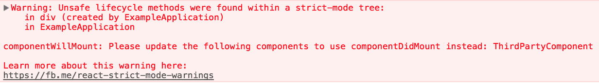

`StrictMode` is a tool for highlighting potential problems in an application. Like `Fragment`, `StrictMode` does not render any visible UI. It activates additional checks and warnings for its descendants.

> Note:
>
> Strict mode checks are run in development mode only; _they do not impact the production build_.

You can enable strict mode for any part of your application. For example:
`embed:strict-mode/enabling-strict-mode.js`

In the above example, strict mode checks will *not* be run against the `Header` and `Footer` components. However, `ComponentOne` and `ComponentTwo`, as well as all of their descendants, will have the checks.

`StrictMode` currently helps with:
* [Identifying components with unsafe lifecycles](#identifying-unsafe-lifecycles)
* [Warning about legacy string ref API usage](#warning-about-legacy-string-ref-api-usage)
* [Detecting unexpected side effects](#detecting-unexpected-side-effects)

Additional functionality will be added with future releases of React.

### Identifying unsafe lifecycles

As explained [in this blog post](/blog/2018/03/27/update-on-async-rendering.html), certain legacy lifecycle methods are unsafe for use in async React applications. However, if your application uses third party libraries, it can be difficult to ensure that these lifecycles aren't being used. Fortunately, strict mode can help with this!

When strict mode is enabled, React compiles a list of all class components using the unsafe lifecycles, and logs a warning message with information about these components, like so:

Addressing the issues identified by strict mode _now_ will make it easier for you to take advantage of async rendering in future releases of React.

### Warning about legacy string ref API usage

Previously, React provided two ways for managing refs: the legacy string ref API and the callback API. Although the string ref API was the more convenient of the two, it had [several downsides](https://github.com/facebook/react/issues/1373) and so our official recommendation was to [use the callback form instead](/docs/refs-and-the-dom.html#legacy-api-string-refs).

React 16.3 added a third option that offers the convenience of a string ref without any of the downsides:
`embed:16-3-release-blog-post/create-ref-example.js`

Since object refs were largely added as a replacement for string refs, strict mode now warns about usage of string refs.

> **Note:**
>
> Callback refs will continue to be supported in addition to the new `createRef` API.
>
> You don't need to replace callback refs in your components. They are slightly more flexible, so they will remain as an advanced feature.

[Learn more about the new `createRef` API here.](/docs/refs-and-the-dom.html)

### Detecting unexpected side effects

Conceptually, React does work in two phases:
* The **render** phase determines what changes need to be made to e.g. the DOM. During this phase, React calls `render` and then compares the result to the previous render.
* The **commit** phase is when React applies any changes. (In the case of React DOM, this is when React inserts, updates, and removes DOM nodes.) React also calls lifecycles like `componentDidMount` and `componentDidUpdate` during this phase.

The commit phase is usually very fast, but rendering can be slow. For this reason, the upcoming async mode (which is not enabled by default yet) breaks the rendering work into pieces, pausing and resuming the work to avoid blocking the browser. This means that React may invoke render phase lifecycles more than once before committing, or it may invoke them without committing at all (because of an error or a higher priority interruption).

Render phase lifecycles include the following class component methods:
* `constructor`
* `componentWillMount`
* `componentWillReceiveProps`
* `componentWillUpdate`
* `getDerivedStateFromProps`
* `shouldComponentUpdate`
* `render`
* `setState` updater functions (the first argument)

Because the above methods might be called more than once, it's important that they do not contain side-effects. Ignoring this rule can lead to a variety of problems, including memory leaks and invalid application state. Unfortunately, it can be difficult to detect these problems as they can often be [non-deterministic](https://en.wikipedia.org/wiki/Deterministic_algorithm).

Strict mode can't automatically detect side effects for you, but it can help you spot them by making them a little more deterministic. This is done by intentionally double-invoking the following methods:

* Class component `constructor` method
* The `render` method
* `setState` updater functions (the first argument)
* The static `getDerivedStateFromProps` lifecycle

> Note:
>
> This only applies to development mode. _Lifecycles will not be double-invoked in production mode._

For example, consider the following code:
`embed:strict-mode/side-effects-in-constructor.js`

At first glance, this code might not seem problematic. But if `SharedApplicationState.recordEvent` is not [idempotent](https://en.wikipedia.org/wiki/Idempotence#Computer_science_meaning), then instantiating this component multiple times could lead to invalid application state. This sort of subtle bug might not manifest during development, or it might do so inconsistently and so be overlooked.

By intentionally double-invoking methods like the component constructor, strict mode makes patterns like this easier to spot.