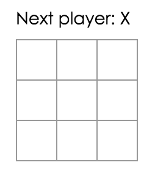
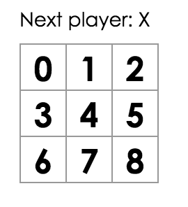
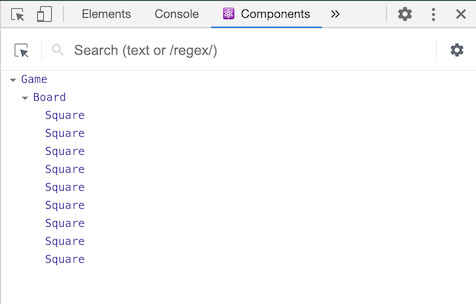

## Before We Start the Tutorial

### What Are We Building?

In this tutorial, we'll show how to build an interactive tic-tac-toe game with React.

You can see what we'll be building here: [Final Result](https://codepen.io/gaearon/pen/gWWZgR?editors=0010). If the code doesn't make sense to you, or if you are unfamiliar with the code's syntax, don't worry! The goal of this tutorial is to help you understand React and its syntax.

We recommend that you check out the tic-tac-toe game before continuing with the tutorial. One of the features that you'll notice is that there is a numbered list to the right of the game's board. This list gives you a history of all of the moves that have occurred in the game, and is updated as the game progresses.

You can close the tic-tac-toe game once you're familiar with it. We'll be starting from a simpler template in this tutorial. Our next step is to set you up so that you can start building the game.

### Prerequisites

We'll assume that you have some familiarity with HTML and JavaScript, but you should be able to follow along even if you haven't used them before.

If you need to review JavaScript, we recommend reading [this guide](https://developer.mozilla.org/en-US/docs/Web/JavaScript/A_re-introduction_to_JavaScript). Note, that we're also using some features from ES6 - a recent version of JavaScript. In this tutorial, we're using [arrow functions](https://developer.mozilla.org/en-US/docs/Web/JavaScript/Reference/Functions/Arrow_functions), [classes](https://developer.mozilla.org/en-US/docs/Web/JavaScript/Reference/Classes), [`let`](https://developer.mozilla.org/en-US/docs/Web/JavaScript/Reference/Statements/let), and [`const`](https://developer.mozilla.org/en-US/docs/Web/JavaScript/Reference/Statements/const) statements. You can use the [Babel REPL](babel://es5-syntax-example) to check what ES6 code compiles to.

## Setup for the Tutorial

There are two ways to complete this tutorial: you can either write the code in your browser, or you can set up a local development environment on your computer.

### Setup Option 1: Write Code in the Browser

This is the quickest way to get started!

First, open this [starter code](https://codepen.io/gaearon/pen/oWWQNa?editors=0010) in a new tab. The new tab should display an empty tic-tac-toe game board and React code. We will be editing the React code in this tutorial.

You can now skip the second setup option, and go to the [Overview](#overview) section to get an overview of React.

### Setup Option 2: Create a Local Development Environment

**This is completely optional and not required for this tutorial!**

This setup requires more work, but it lets you complete the tutorial using an editor of your choice.

Here are the steps to follow:

1. Make sure you have a recent version of [Node.js](https://nodejs.org/en/) installed.
2. Follow the [installation instructions](/docs/add-react-to-a-new-app.html) to create a new project.

```bash
npm install -g create-react-app
create-react-app my-app
```

3. Delete all files in the `src/` folder of the new project (don't delete the folder, just its contents).

```bash
cd my-app
rm -f src/*
```

4. Add a file named `index.css` in the `src/` folder with [this CSS code](https://codepen.io/gaearon/pen/oWWQNa?editors=0100).

5. Add a file named `index.js` in the `src/` folder with [this JS code](https://codepen.io/gaearon/pen/oWWQNa?editors=0010).

6. Add these three lines to the top of `index.js` in the `src/` folder:

```js
import React from 'react';
import ReactDOM from 'react-dom';
import './index.css';
```

Now if you run `npm start` in the project folder and open `http://localhost:3000` in the browser, you should see an empty tic-tac-toe field.

We recommend following [these instructions](http://babeljs.io/docs/editors) to configure syntax highlighting for your editor.

### Help, I'm Stuck!

If you get stuck, check out the [community support resources](/community/support.html). In particular, [Reactiflux Chat](/community/support.html#reactiflux-chat) is a great way to get help quickly. If you don't receive an answer, or if you remain stuck, please file an issue, and we'll help you out.

## Overview

Now that you're setup, let's get an overview of React!

### What is React?

React is a declarative, efficient, and flexible JavaScript library for building user interfaces.

React has a few different kinds of components, but we'll start with `React.Component` subclasses:

```javascript
class ShoppingList extends React.Component {
  render() {
    return (
      <div className="shopping-list">
        <h1>Shopping List for {this.props.name}</h1>
        <ul>
          <li>Instagram</li>
          <li>WhatsApp</li>
          <li>Oculus</li>
        </ul>
      </div>
    );
  }
}

// Example usage: <ShoppingList name="Mark" />
```

We'll get to the funny XML-like tags soon. Our components tell React what we want to render. When our data changes, React will efficiently update and re-render our components.

Here, ShoppingList is a **React component class**, or **React component type**. A component takes in parameters, called `props`, and returns a hierarchy of views to display via the `render` method.

The `render` method returns a *description* of what you want to render. React takes the description and renders it. In particular, `render` returns a **React element**, which is a lightweight description of what to render. Most React developers use a special syntax called "JSX" which makes these structures easier to write. The `<div />` syntax is transformed at build time to `React.createElement('div')`. The example above is equivalent to:

```javascript
return React.createElement('div', {className: 'shopping-list'},
  React.createElement('h1', /* ... h1 children ... */),
  React.createElement('ul', /* ... ul children ... */)
);
```

[See full expanded version.](babel://tutorial-expanded-version)

If you're curious, `createElement()` is described in more detail in the [API reference](/docs/react-api.html#createelement), but we won't be using it in this tutorial. Instead, we will keep using JSX.

You can put JavaScript expressions within braces inside JSX. Each React element is a JavaScript object that you can store in a variable or pass around in your program.

The `ShoppingList` component only renders built-in DOM components. You can compose and render custom React components. In our `ShoppingList` example we can compose and render a React component `<ShoppingList />`. Each React component is encapsulated and can operate independently; this allows you to build complex UIs from simple components.

## The Tutorial

If you're going to work on the tutorial in your browser, open this code in a new tab: [Starter Code](https://codepen.io/gaearon/pen/oWWQNa?editors=0010).
This is the base of what we're building. We've provided the CSS styling so that you only need focus on learning React and programming the tic-tac-toe game.

By inspecting the code, you'll notice that we have three React components:

* Square
* Board
* Game

The Square component renders a single `<button>` and the Board renders 9 squares. The Game component renders a board with placeholder values which we'll modify later. There are currently no interactive components.

### Passing Data Through Props

Let's try passing some data from our Board component to our Square component.

In Board's `renderSquare` method, change the code to pass a prop called `value` to the Square:

```js{3}
class Board extends React.Component {
  renderSquare(i) {
    return <Square value={i} />;
  }
```

Change Square's `render` method to show that value by replacing `{/* TODO */}` with `{this.props.value}`:

```js{5}
class Square extends React.Component {
  render() {
    return (
      <button className="square">
        {this.props.value}
      </button>
    );
  }
}
```

Before:



After: You should see a number in each square in the rendered output.



[View the current code.](https://codepen.io/gaearon/pen/aWWQOG?editors=0010)

### Add an Interactive Component

Let's fill the Square components with an "X" whenever we click them. 
We'll change the button tag that is returned in the Square's `render()` function to this:

```javascript{4}
class Square extends React.Component {
  render() {
    return (
      <button className="square" onClick={() => alert('click')}>
        {this.props.value}
      </button>
    );
  }
}
```

If we click on a Square now, we should get an alert in our browser.

The `onClick` assignment uses the new JavaScript [arrow function](https://developer.mozilla.org/en/docs/Web/JavaScript/Reference/Functions/Arrow_functions) syntax. Note that we're passing a function as the `onClick` prop. Passing `onClick={alert('click')}` would fire the alert immediately instead of when a Square is clicked.

React components can have state by setting `this.state` in their constructors. `this.state` should be considered as a private member of a React component. Let's store the current value of the Square in `this.state`, and change it when the Square is clicked.

First, we'll add a constructor to the class to initialize the state:

```javascript{2-7}
class Square extends React.Component {
  constructor(props) {
    super(props);
    this.state = {
      value: null,
    };
  }

  render() {
    return (
      <button className="square" onClick={() => alert('click')}>
        {this.props.value}
      </button>
    );
  }
}
```

In [JavaScript classes](https://developer.mozilla.org/en-US/docs/Web/JavaScript/Reference/Classes), you need to explicitly call `super();` when defining the constructor of a subclass.

Now we'll change the Square's `render` method to display the current state's value when clicked:

* Replace `this.props.value` with `this.state.value` inside the `<button>` tag.
* Replace the `() => alert()` event handler with `() => this.setState({value: 'X'})`.

Now the `<button>` tag that is returned by the Square's `render` method looks like this:

```javascript{10-12}
class Square extends React.Component {
  constructor(props) {
    super(props);
    this.state = {
      value: null,
    };
  }

  render() {
    return (
      <button className="square" onClick={() => this.setState({value: 'X'})}>
        {this.state.value}
      </button>
    );
  }
}
```

Whenever `this.setState` is called, an update for the Square is scheduled. React will update and re-render the Square and the Square's `this.state.value` will be `'X'`. We'll be able to see the `X` on the game board. If you click on any Square, an `X` should show up.

In React, if a component is updated and has descendents, React will also update and re-render the component's descendants. 

[View the current code.](https://codepen.io/gaearon/pen/VbbVLg?editors=0010)

### Developer Tools

The React Devtools extension for [Chrome](https://chrome.google.com/webstore/detail/react-developer-tools/fmkadmapgofadopljbjfkapdkoienihi?hl=en) and [Firefox](https://addons.mozilla.org/en-US/firefox/addon/react-devtools/) lets you inspect a React component tree with your browser's developer tools.



The React DevTools let you check the props and the state of your React components.

After installing React DevTools, you can right-click on any element on the page, click "Inspect" to open the developer tools, and the React tab will appear as the last tab to the right.

**However, note there are a few extra steps to get it working with CodePen:**

1. Log in or register and confirm your email (required to prevent spam).
2. Click the "Fork" button.
3. Click "Change View" and then choose "Debug mode".
4. In the new tab that opens, the devtools should now have a React tab.

## Lifting State Up

We now have the basic building blocks for our tic-tac-toe game. To have a complete game, we now need to alternate placing "X"s and ""O"s on the board, and we need a way to determine a winner. Currently, each Square component maintains the game's state. To check for a winner, we'll maintain the value of each of the 9 squares in one location.

We may think that Board should just ask each Square for the Square's state. Although this approach is possible in React, we discourage it because the code becomes difficult to understand, susceptible to bugs, and hard to refactor. Instead, the best approach is to store the game's state in the Board component instead of in each Square. The Board component can tell each Square what to display.

**To collect data from multiple children or have two child components communicate with each other, the childrens' state should reside in the parent component. The parent can pass the state back down to the children by using props; this keeps the child components in sync with each other and with the parent.**

Moving states into parent components is common when React components are refactored - let's take this opportunity to try it out. We'll add a constructor to the Board and set the Board's initial state to contain an array with 9 nulls. These 9 nulls correspond to the 9 squares:

```javascript{2-7}
class Board extends React.Component {
  constructor(props) {
    super(props);
    this.state = {
      squares: Array(9).fill(null),
    };
  }

  renderSquare(i) {
    return <Square value={i} />;
  }

  render() {
    const status = 'Next player: X';

    return (
      <div>
        <div className="status">{status}</div>
        <div className="board-row">
          {this.renderSquare(0)}
          {this.renderSquare(1)}
          {this.renderSquare(2)}
        </div>
        <div className="board-row">
          {this.renderSquare(3)}
          {this.renderSquare(4)}
          {this.renderSquare(5)}
        </div>
        <div className="board-row">
          {this.renderSquare(6)}
          {this.renderSquare(7)}
          {this.renderSquare(8)}
        </div>
      </div>
    );
  }
}
```

We'll fill the board in later so that a board looks something like:

```javascript
[
  'O', null, 'X',
  'X', 'X', 'O',
  'O', null, null,
]
```

The Board's `renderSquare` method currently looks like this:

```javascript
  renderSquare(i) {
    return <Square value={i} />;
  }
```

We'll modify `renderSquare` to pass a prop called `value` to Square:

```javascript{2}
  renderSquare(i) {
    return <Square value={this.state.squares[i]} />;
  }
```

[View the current code.](https://codepen.io/gaearon/pen/gWWQPY?editors=0010)

We now need to change what happens when a Square is clicked. The Board component now maintains which squares are filled. We need to create a way for the Square to update the Board's state. Since state is considered to be a private member of a component, we cannot update the Board's state directly from Square.

To maintain the Board's state's privacy, we'll pass down a function from the Board to the Square. This function will get called when a Square is clicked. We'll change the `renderSquare` method in Board to:

```javascript{5}
  renderSquare(i) {
    return (
      <Square
        value={this.state.squares[i]}
        onClick={() => this.handleClick(i)}
      />
    );
  }
```

We split the returned element into multiple lines for readability, and added parentheses so that JavaScript doesn't insert a semicolon after `return` and break our code.

Now we're passing down two props from Board to Square: `value` and `onClick`. The `onClick` prop is a function that Square can call when clicked. We'll make the following changes to Square:

* Replace `this.state.value` with `this.props.value` in Square's `render` method
* Replace `this.setState()` with `this.props.onClick()` in Square's `render` method
* Delete the `constructor` from Square because it Square no longer keeps track of the game's state

After these changes, the Square component looks like this:

```javascript{1,2,4,5}
class Square extends React.Component {
  render() {
    return (
      <button className="square" onClick={() => this.props.onClick()}>
        {this.props.value}
      </button>
    );
  }
}
```

When a Square is clicked, the `onClick` function provided by the Board is called. Here's a review of how this is achieved:

1. The `onClick` prop on the built-in DOM `<button>` component tells React to set up a click event listener.
2. When the button is clicked, React will call the `onClick` event handler that is defined in Square's `render()` method.
3. This event handler calls `this.props.onClick()`. The Square's `onClick` prop was specified by the Board.
4. Since the Board passed `onClick={() => this.handleClick(i)}` to Square, the Square calls `this.handleClick(i)` when clicked.
5. We have not defined the `handleClick()` method yet, so our code crashes.

Note that DOM `<button>` element's `onClick` attribute has a special meaning to React. We could have named Square's `onClick` prop or Board's `handleClick` method differently. In React, however, it is a convention to use `on[Event]` names for props which represent events and `handle[Event]` for the methods which handle the events.

When we try to click a Square, we should get an error because we haven't defined `handleClick` yet. We'll now add `handleClick` to the Board class:

```javascript{9-13}
class Board extends React.Component {
  constructor(props) {
    super(props);
    this.state = {
      squares: Array(9).fill(null),
    };
  }

  handleClick(i) {
    const squares = this.state.squares.slice();
    squares[i] = 'X';
    this.setState({squares: squares});
  }

  renderSquare(i) {
    return (
      <Square
        value={this.state.squares[i]}
        onClick={() => this.handleClick(i)}
      />
    );
  }

  render() {
    const status = 'Next player: X';

    return (
      <div>
        <div className="status">{status}</div>
        <div className="board-row">
          {this.renderSquare(0)}
          {this.renderSquare(1)}
          {this.renderSquare(2)}
        </div>
        <div className="board-row">
          {this.renderSquare(3)}
          {this.renderSquare(4)}
          {this.renderSquare(5)}
        </div>
        <div className="board-row">
          {this.renderSquare(6)}
          {this.renderSquare(7)}
          {this.renderSquare(8)}
        </div>
      </div>
    );
  }
}
```

[View the current code.](https://codepen.io/gaearon/pen/ybbQJX?editors=0010)

In `handleClick`, we call `.slice()` to create a copy the `squares` array to modify instead of modifying the existing array. To explain why we create a copy of the `squares` array, read our [section](/tutorial/tutorial.html#why-immutability-is-important) about "immutability".

We'll be able to click on the Squares to fill them again. Whenever Board's state changes, the Square components re-render automatically. Since the Square components no longer maintain state, the Square components receive values from the Board component and inform the Board component when they're clicked. In React terms, the Square components are now **controlled components**.

### Why Immutability Is Important

In the previous code example, we suggested that you use the `.slice()` operator to create a copy the `squares` array to modify instead of modifying the existing array. We'll now discuss immutability and why it is an important concept to learn.

There are generally two methods for changing data. The first method is to *mutate* the data by directly changing the data's values. The second method is to replace the data with a new copy which has the desired changes.

#### Data Change with Mutation
```javascript
var player = {score: 1, name: 'Jeff'};
player.score = 2;
// Now player is {score: 2, name: 'Jeff'}
```

#### Data Change without Mutation
```javascript
var player = {score: 1, name: 'Jeff'};

var newPlayer = Object.assign({}, player, {score: 2});
// Now player is unchanged, but newPlayer is {score: 2, name: 'Jeff'}

// Or if you are using object spread syntax proposal, you can write:
// var newPlayer = {...player, score: 2};
```

The end result is the same but by not mutating (or changing the underlying data) directly, our component and overall application performance improves.

#### Why We Use Immutability in this Tutorial

Immutability makes complex features much easier to implement. Later in this tutorial, we will implement a feature that allows us to review the tic-tac-toe game's history. Avoiding direct data mutation allows us to keep previous versions of the game's history.

#### Detecting Changes

Detecting changes in mutable objects is complex because they are modified directly. This detection requires the mutable object to be compared to previous copies of itself and the entire object tree to be traversed.

Detecting changes in immutable objects is considerably easier. If the immutable object that is being referenced is different than the previous one, then the object has changed.

#### Determining When to Re-render in React

The main benefit of immutability is that it helps you build _pure components_ in React. Immutable data can easily determine if changes have been made which helps to determine when a component requires re-renderering.

You can learn more about `shouldComponentUpdate()` and how you can build *pure components* by reading [Optimizing Performance](/docs/optimizing-performance.html#examples).

### Functional Components

We'll now change the Square to be a **functional component**. In React, **functional components** are components that only contain a `render` method. Instead of than defining a class which extends `React.Component`, we can write a function that takes `props` as input and returns what should be rendered.

In general, you'll be able to write components in your React applications as functional components: these components tend to be easier to write and React will optimize them in the future.

Replace the Square class with this function:

```javascript
function Square(props) {
  return (
    <button className="square" onClick={props.onClick}>
      {props.value}
    </button>
  );
}
```

We'll need to change `this.props` to `props` both times it appears.

When we modified the Square to be a functional component, we also changed `onClick={() => props.onClick()}` to `onClick={props.onClick}`. `onClick={props.onClick()}` will not work because it will call the function that is associated with `props.onClick` instead of passing it down.

[View the current code.](https://codepen.io/gaearon/pen/QvvJOv?editors=0010)

### Taking Turns

We now need to fix an obvious defect in our tic-tac-toe game: the "O"s cannot be marked on the board.

For now, we'll set the the first move to be 'X' by default. We can set this default by modifying the initial state in our Board constructor:

```javascript{6}
class Board extends React.Component {
  constructor(props) {
    super(props);
    this.state = {
      squares: Array(9).fill(null),
      xIsNext: true,
    };
  }
```

Each time a player moves, the boolean, `xIsNext` will be flipped to determine which player goes next and the game's state will be saved. We'll update the Board's `handleClick` function to flip the value of `xIsNext`:

```javascript{3,6}
  handleClick(i) {
    const squares = this.state.squares.slice();
    squares[i] = this.state.xIsNext ? 'X' : 'O';
    this.setState({
      squares: squares,
      xIsNext: !this.state.xIsNext,
    });
  }
```

With this change, "X"s and "O"s can take turns. Next, change the "status" text in Board's `render` so that it displays which player has the next turn:

```javascript{2}
  render() {
    const status = 'Next player: ' + (this.state.xIsNext ? 'X' : 'O');

    return (
      // the rest has not changed
```

After applying these changes, you should have this Board component:

```javascript{6,11-16,29}
class Board extends React.Component {
  constructor(props) {
    super(props);
    this.state = {
      squares: Array(9).fill(null),
      xIsNext: true,
    };
  }

  handleClick(i) {
    const squares = this.state.squares.slice();
    squares[i] = this.state.xIsNext ? 'X' : 'O';
    this.setState({
      squares: squares,
      xIsNext: !this.state.xIsNext,
    });
  }

  renderSquare(i) {
    return (
      <Square
        value={this.state.squares[i]}
        onClick={() => this.handleClick(i)}
      />
    );
  }

  render() {
    const status = 'Next player: ' + (this.state.xIsNext ? 'X' : 'O');

    return (
      <div>
        <div className="status">{status}</div>
        <div className="board-row">
          {this.renderSquare(0)}
          {this.renderSquare(1)}
          {this.renderSquare(2)}
        </div>
        <div className="board-row">
          {this.renderSquare(3)}
          {this.renderSquare(4)}
          {this.renderSquare(5)}
        </div>
        <div className="board-row">
          {this.renderSquare(6)}
          {this.renderSquare(7)}
          {this.renderSquare(8)}
        </div>
      </div>
    );
  }
}
```

[View the current code.](https://codepen.io/gaearon/pen/KmmrBy?editors=0010)

### Declaring a Winner

Since we can show which player's turn is next, we should also indicate which player wins the game. We can indicate a winner by adding this helper function to the end of the file:

```javascript
function calculateWinner(squares) {
  const lines = [
    [0, 1, 2],
    [3, 4, 5],
    [6, 7, 8],
    [0, 3, 6],
    [1, 4, 7],
    [2, 5, 8],
    [0, 4, 8],
    [2, 4, 6],
  ];
  for (let i = 0; i < lines.length; i++) {
    const [a, b, c] = lines[i];
    if (squares[a] && squares[a] === squares[b] && squares[a] === squares[c]) {
      return squares[a];
    }
  }
  return null;
}
```

`calculateWinner(squares)` will be called in the Board's `render` function to check if a player has won. If a player has won, we can display text such as "Xs Win" or "Os Win".

We'll replace the `status` declaration in Board's `render` function with this code:

```javascript{2-8}
  render() {
    const winner = calculateWinner(this.state.squares);
    let status;
    if (winner) {
      status = 'Winner: ' + winner;
    } else {
      status = 'Next player: ' + (this.state.xIsNext ? 'X' : 'O');
    }

    return (
      // the rest has not changed
```

You can now change the Board's `handleClick` function to return early by ignoring a click if someone has won the game or if a Square is already filled:

```javascript{3-5}
  handleClick(i) {
    const squares = this.state.squares.slice();
    if (calculateWinner(squares) || squares[i]) {
      return;
    }
    squares[i] = this.state.xIsNext ? 'X' : 'O';
    this.setState({
      squares: squares,
      xIsNext: !this.state.xIsNext,
    });
  }
```

Congratulations! You have a working tic-tac-toe game _and_ you know the basics of React.

[View the current code.](https://codepen.io/gaearon/pen/LyyXgK?editors=0010)

## Storing the Tic-Tac-Toe Game's History

By storing the tic-tac-toe game's history, we can revisit past Board configurations. We can achieve this by storing the `squares` array before replacing it with a new `squares` array.

We'll create a `history` object to store the `squares` arrays:

```javascript
history = [
  {
    squares: [
      null, null, null,
      null, null, null,
      null, null, null,
    ]
  },
  {
    squares: [
      null, null, null,
      null, 'X', null,
      null, null, null,
    ]
  },
  // ...
]
```

We'll want a top-level Game component to be responsible for displaying the game's history and we can achieve this by moving the state from the Board component to the Game component. Moving the state into the Game component allows us to store all of the game's data at the top-level of our component tree; this includes the `history`.

First, we'll set up the initial state for the Game component within its constructor:

```javascript{2-10}
class Game extends React.Component {
  constructor(props) {
    super(props);
    this.state = {
      history: [{
        squares: Array(9).fill(null),
      }],
      xIsNext: true,
    };
  }

  render() {
    return (
      <div className="game">
        <div className="game-board">
          <Board />
        </div>
        <div className="game-info">
          <div>{/* status */}</div>
          <ol>{/* TODO */}</ol>
        </div>
      </div>
    );
  }
}
```

Next, we'll have the Board component obtain `squares` and `onClick` props from the Game component. We'll pass the location of each Square into the `onClick` handler to indicate which Square was clicked. Here are the required steps to transform the Board component:

* Delete the `constructor` in Board.
* Replace `this.state.squares[i]` with `this.props.squares[i]` in Board's `renderSquare`.
* Replace `this.handleClick(i)` with `this.props.onClick(i)` in Board's `renderSquare`.

The Board component now looks like this:

```javascript{17,18}
class Board extends React.Component {
  handleClick(i) {
    const squares = this.state.squares.slice();
    if (calculateWinner(squares) || squares[i]) {
      return;
    }
    squares[i] = this.state.xIsNext ? 'X' : 'O';
    this.setState({
      squares: squares,
      xIsNext: !this.state.xIsNext,
    });
  }

  renderSquare(i) {
    return (
      <Square
        value={this.props.squares[i]}
        onClick={() => this.props.onClick(i)}
      />
    );
  }

  render() {
    const winner = calculateWinner(this.state.squares);
    let status;
    if (winner) {
      status = 'Winner: ' + winner;
    } else {
      status = 'Next player: ' + (this.state.xIsNext ? 'X' : 'O');
    }

    return (
      <div>
        <div className="status">{status}</div>
        <div className="board-row">
          {this.renderSquare(0)}
          {this.renderSquare(1)}
          {this.renderSquare(2)}
        </div>
        <div className="board-row">
          {this.renderSquare(3)}
          {this.renderSquare(4)}
          {this.renderSquare(5)}
        </div>
        <div className="board-row">
          {this.renderSquare(6)}
          {this.renderSquare(7)}
          {this.renderSquare(8)}
        </div>
      </div>
    );
  }
}
```

We'll update the Game component's `render` function to use the most recent history entry to determine and display the game's status:

```javascript{2-11,16-19,22}
  render() {
    const history = this.state.history;
    const current = history[history.length - 1];
    const winner = calculateWinner(current.squares);

    let status;
    if (winner) {
      status = 'Winner: ' + winner;
    } else {
      status = 'Next player: ' + (this.state.xIsNext ? 'X' : 'O');
    }

    return (
      <div className="game">
        <div className="game-board">
          <Board
            squares={current.squares}
            onClick={(i) => this.handleClick(i)}
          />
        </div>
        <div className="game-info">
          <div>{status}</div>
          <ol>{/* TODO */}</ol>
        </div>
      </div>
    );
  }
```

Since the Game is now rendering the game's status, we can refactor the Board's `render` function. After refactoring, the Board's `render` function looks like this:

```js{1-4}
  render() {
    return (
      <div>
        <div className="board-row">
          {this.renderSquare(0)}
          {this.renderSquare(1)}
          {this.renderSquare(2)}
        </div>
        <div className="board-row">
          {this.renderSquare(3)}
          {this.renderSquare(4)}
          {this.renderSquare(5)}
        </div>
        <div className="board-row">
          {this.renderSquare(6)}
          {this.renderSquare(7)}
          {this.renderSquare(8)}
        </div>
      </div>
    );
  }
```

Next, we need to move the `handleClick` method from the Board component to the Game component. We also need to modify `handleClick` because the Game component's state is structured differently. Within the Game's `handleClick` method, we concatenate new history entries onto `history`. Concatenation allows us to maintain an accurate history.

```javascript{2-4,10-12}
  handleClick(i) {
    const history = this.state.history;
    const current = history[history.length - 1];
    const squares = current.squares.slice();
    if (calculateWinner(squares) || squares[i]) {
      return;
    }
    squares[i] = this.state.xIsNext ? 'X' : 'O';
    this.setState({
      history: history.concat([{
        squares: squares,
      }]),
      xIsNext: !this.state.xIsNext,
    });
  }
```

At this point, the Board component only needs the `renderSquare` and `render` methods. The game's state and the `handleClick` method should be in the Game component.

[View the current code.](https://codepen.io/gaearon/pen/EmmOqJ?editors=0010)

### Displaying the Tic-Tac-Toe Game's History

Since we are recording the tic-tac-toe game's history, we can now display the tic-tac-toe game's history. We learned earlier that React elements are first-class JavaScript objects; we can store them and/or pass them around in our applications. To render multiple items in React, we create an array of React elements. Using the `map` function, we can map our data to React elements. The output from the `map` function is an array of React elements. 

Let's use the `map` function in Game's `render` method:

```javascript{6-15,34}
  render() {
    const history = this.state.history;
    const current = history[history.length - 1];
    const winner = calculateWinner(current.squares);

    const moves = history.map((step, move) => {
      const desc = move ?
        'Go to move #' + move :
        'Go to game start';
      return (
        <li>
          <button onClick={() => this.jumpTo(move)}>{desc}</button>
        </li>
      );
    });

    let status;
    if (winner) {
      status = 'Winner: ' + winner;
    } else {
      status = 'Next player: ' + (this.state.xIsNext ? 'X' : 'O');
    }

    return (
      <div className="game">
        <div className="game-board">
          <Board
            squares={current.squares}
            onClick={(i) => this.handleClick(i)}
          />
        </div>
        <div className="game-info">
          <div>{status}</div>
          <ol>{moves}</ol>
        </div>
      </div>
    );
  }
```

[View the current code.](https://codepen.io/gaearon/pen/EmmGEa?editors=0010)

For each move in the tic-tac-toes's game's history, we create a list item `<li>` which contains a button `<button>`. The button has a `onClick` handler which we'll implement. After implementing the `onClick` handler, we should see a list of the moves that have occurred in the game and a warning that says:

>  Warning:
>  Each child in an array or iterator should have a unique "key" prop. Check the render method of "Game".

Let's discuss what the above warning means.

### Keys

When we render a list, React stores some information about each rendered list item. When we update a list, React needs to determine what has changed. We could have added, removed, re-arranged, or updated the list's items.

Imagine transitioning from

```html
<li>Alexa: 7 tasks left</li>
<li>Ben: 5 tasks left</li>
```

to

```html
<li>Ben: 9 tasks left</li>
<li>Claudia: 8 tasks left</li>
<li>Alexa: 5 tasks left</li>
```

From our perspective, our transition swapped Alexa and Ben's ordering and inserted Claudia between Alexa and Ben. However, React is a computer program and does not know what we intended. Because React cannot know our intentions, we need to specify a *key* property for each list item to differentiate each list item from its siblings. The strings `alexa`, `ben`, `claudia` may be used as keys. If we had access to a database, Alexa, Ben, and Claudia's database IDs could be used as keys.

```html
<li key={user.id}>{user.name}: {user.taskCount} tasks left</li>
```

`key` is a special and reserved property in React (along with `ref`, a more advanced feature). When an element is created, React extracts the `key` property and stores the key directly on the returned element. Even though `key` may look like it belongs in `props`, `key` cannot be referenced using `this.props.key`. React automatically uses `key` to decide which components to update. A component cannot inquire about its `key`.

When a list is re-rendered, React takes each list item's key and searches the previous list's items for a matching key. If the current list has a key that does not exist in the previous list, React creates a component. If the current list is missing a key that exists in the previous list, React destroys a component. Keys tell React about the identity of each component which allows React to maintain state between re-renders. If a component's key changes, the component will be destroyed and re-created with a new state.

**It's strongly recommended that you assign proper keys whenever you build dynamic lists.** If you don't have an appropriate key, you may want to consider restructuring your data so that you do.

If no key is specified, React will present a warning and use the array index as a key by default. Using the array index as a key is problematic when trying to re-order a list's items or inserting/removing list items. Explicitly passing `key={i}` silences the warning but has the same problems as array indices and is not recommended.

Keys do not need to be globally unique. Keys only needs to be unique between components and their sibilings.


### Using Keys to Display the Tic-Tac-Toe Game's History

In the tic-tac-toe game's history, we have a unique ID for each step which was recorded when the step occurred. In the Game component's `render` method, we can add the key as `<li key={move}>` and React's warning about keys should disappear:

```js{6}
    const moves = history.map((step, move) => {
      const desc = move ?
        'Go to move #' + move :
        'Go to game start';
      return (
        <li key={move}>
          <button onClick={() => this.jumpTo(move)}>{desc}</button>
        </li>
      );
    });
```

[View the current code.](https://codepen.io/gaearon/pen/PmmXRE?editors=0010)

Clicking any of the list item's buttons throws an error because the `jumpTo` method is undefined. Before we implement `jumpTo`, we'll add `stepNumber` to the Game component's state to indicate which step we're currently viewing.

First, add `stepNumber: 0` to the initial state in Game's `constructor`:

```js{8}
class Game extends React.Component {
  constructor(props) {
    super(props);
    this.state = {
      history: [{
        squares: Array(9).fill(null),
      }],
      stepNumber: 0,
      xIsNext: true,
    };
  }
```

Next, we'll define the `jumpTo` method in Game to update that `stepNumber`. We also set `xIsNext` to true if the number that we're changing `stepNumber` to is even:

```javascript{5-10}
  handleClick(i) {
    // this method has not changed
  }

  jumpTo(step) {
    this.setState({
      stepNumber: step,
      xIsNext: (step % 2) === 0,
    });
  }

  render() {
    // this method has not changed
  }
```

When a new move is made, we'll update `stepNumber` by adding `stepNumber: history.length` as a parameter to `this.setState`. `this.setState` is called in Game's `handleClick` method. We'll also update `handleClick` to be aware of `stepNumber` when reading the current state. Having `handleClick` be aware of `stepNumber` will enable us to render a specific portion of the game's history:

```javascript{2,13}
  handleClick(i) {
    const history = this.state.history.slice(0, this.state.stepNumber + 1);
    const current = history[history.length - 1];
    const squares = current.squares.slice();
    if (calculateWinner(squares) || squares[i]) {
      return;
    }
    squares[i] = this.state.xIsNext ? 'X' : 'O';
    this.setState({
      history: history.concat([{
        squares: squares
      }]),
      stepNumber: history.length,
      xIsNext: !this.state.xIsNext,
    });
  }
```

We modify the Game component's `render` method to render the game's history:

```javascript{3}
  render() {
    const history = this.state.history;
    const current = history[this.state.stepNumber];
    const winner = calculateWinner(current.squares);

    // the rest has not changed
```

[View the current code.](https://codepen.io/gaearon/pen/gWWZgR?editors=0010)

If we click on any step in the game's history, the tic-tac-toe board should immediately update to show what the board looked like after that step occurred.

### Wrapping Up

Congratulations! You've created a tic-tac-toe game that:

* Lets you play tic-tac-toe,
* Indicates when a player has won the game,
* Stores the game's history as the game progresses,
* Allows players to review the game's history and see previous versions of the game's board.

Nice work! We hope you now feel like you have a decent grasp on how React works.

Check out the final result here: [Final Result](https://codepen.io/gaearon/pen/gWWZgR?editors=0010).

If you have extra time or want to practice your new React skills, here are some ideas for improvements that you could make to the tic-tac-toe game which are listed in order of increasing difficulty:

1. Display the location for each move in the format (col, row) in the move history list.
2. Bold the currently selected item in the move list.
3. Rewrite Board to use two loops to make the squares instead of hardcoding them.
4. Add a toggle button that lets you sort the moves in either ascending or descending order.
5. When someone wins, highlight the three squares that caused the win.
6. When no one wins, display a message about the result being a draw.

Throughout this tutorial, we touched on React concepts including elements, components, props, and state. For a more detailed explanation of each of these topics, check out [the rest of the documentation](/docs/hello-world.html). To learn more about defining components, check out the [`React.Component` API reference](/docs/react-component.html).
